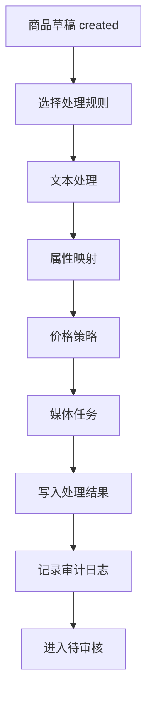
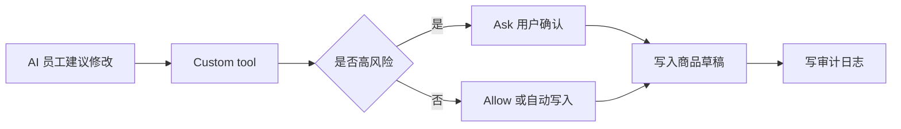

# 商品搬运工具 NocoBase 实施路线图与任务拆解

版本：v1.0  
日期：2026-06-29  
输入文档：

- `outputs/nocobase-ai-listing-prd-dev-design.md`
- `outputs/nocobase-ai-developer-official-guide.md`

---

## 1. 这份文档解决什么问题

前两份文档已经回答：

- 产品要做什么。
- 为什么用 NocoBase。
- 页面、数据模型、AI 员工、工作流、插件边界怎么设计。
- 后续 AI 开发者应该遵守哪些 NocoBase 官方开发规范。

这份文档继续往下走，回答“现在怎么开工”：

1. 先做哪些模块，后做哪些模块。
2. 哪些任务用 NocoBase 配置完成，哪些必须写插件。
3. 每个阶段的交付物是什么。
4. 每个开发任务的验收标准是什么。
5. 给后续 AI 开发者如何分配任务。

结论先说：**第一版不要一次性做 Accio Work 完整体，而要先打通“单商品 URL -> 商品草稿 -> AI 处理 -> 人工审核 -> 模拟发布/单平台发布”的闭环。**

---

## 2. 总体开发策略

### 2.1 MVP 目标

MVP 只追求一个稳定闭环：


MVP 成功标准：

- 小白运营只输入一个商品链接，就能得到结构化商品草稿。
- 系统能展示抓取、处理、审核、发布状态。
- AI 员工可以辅助改标题、补属性、解释失败原因，但不能无审核直接发布。
- 每次 AI 修改字段都有审计记录。
- 发布前能做基础校验。
- 发布失败能看到原因并重试。

### 2.2 第一版技术选择

| 能力 | 第一版做法 | 原因 |
|---|---|---|
| 核心数据模型 | 插件内定义 collections | 便于后续迁移和插件化交付 |
| 页面 | 插件页面 + NocoBase UI 配置结合 | 设计稿页面交互较复杂，纯低代码不够顺 |
| URL 抓取 | 插件服务端 API + job runner | 抓取是核心能力，需要稳定可控 |
| AI 处理 | 先用工作流/自定义工具接 AI 员工 | 方便审计和人工确认 |
| 图片处理 | 第一版只做任务结构和占位处理 | 去水印/白底图可后续接外部服务 |
| 发布 | 先做模拟发布，再接一个目标平台 | 避免早期真实发布风险 |
| 权限 | NocoBase ACL + AI 工具 Ask/Allow | 防止 AI 越权写入 |
| 发布记录 | 独立 collection | 必须可追踪、可重试 |

### 2.3 单插件优先

MVP 阶段先做一个主插件：

```text
@crossborder/plugin-ai-listing
```

暂不拆多个插件，避免早期集成成本过高。插件内按目录分模块：

```text
src/
  server/
    collections/
    resources/
    services/
    jobs/
    workflows/
    acl/
  client-v2/
    routes/
    pages/
    blocks/
    components/
    actions/
    locales/
```

等 URL 抓取、AI 处理、发布闭环跑通后，再考虑拆分：

- `plugin-ai-listing-core`
- `plugin-ai-listing-capture`
- `plugin-ai-listing-processing`
- `plugin-ai-listing-publish`
- `plugin-ai-listing-ai`

---

## 3. 里程碑路线图

### P0：环境确认与插件骨架

目标：确认 NocoBase 环境可运行，创建并启用插件骨架。

交付物：

- 插件 `@crossborder/plugin-ai-listing`。
- client-v2 入口。
- server 入口。
- 基础路由占位。
- i18n 文件。
- 插件可启用、可停用。

验收标准：

- NocoBase 可启动。
- 插件出现在插件列表。
- 插件启用后无报错。
- `/v2/ai-listing/dashboard` 至少能打开占位页。

建议任务：

| 任务 ID | 任务 | 推荐能力 | 验收 |
|---|---|---|---|
| P0-01 | 确认环境、版本、插件能力 | env-bootstrap / plugin-manage | 输出当前环境状态 |
| P0-02 | 创建插件骨架 | nocobase-plugin-development | 插件目录生成 |
| P0-03 | 配置 client-v2 入口和基础路由 | plugin development | `/v2/ai-listing/dashboard` 可访问 |
| P0-04 | 配置 server 入口和基础 health API | plugin development | API 返回正常 |
| P0-05 | 启用插件并读回校验 | plugin-manage | enabled=true |

### P1：数据模型与基础权限

目标：先把业务骨架立住，确保后面所有页面和工作流有稳定的数据基础。

核心 collections：

1. `aiListingProducts`
2. `aiListingSkus`
3. `aiListingAssets`
4. `aiListingCaptureTasks`
5. `aiListingTaskSteps`
6. `aiListingProcessRules`
7. `aiListingPublishTasks`
8. `aiListingPublishRecords`
9. `aiListingPlatformAccounts`
10. `aiListingAuditLogs`

交付物：

- collections 定义。
- 字段、关系、索引。
- ACL 基础角色。
- 示例种子数据。

验收标准：

- 所有表能创建。
- 商品与 SKU、资产、任务、发布记录关系正确。
- 运营角色只能操作自己店铺/任务范围内的数据。
- AI 员工不能绕过 ACL 直接写核心表。

建议任务：

| 任务 ID | 任务 | 推荐能力 | 验收 |
|---|---|---|---|
| P1-01 | 定义商品主表 | data-modeling / plugin collection | 字段完整，状态机字段存在 |
| P1-02 | 定义 SKU 与资产表 | data-modeling / plugin collection | 商品一对多关系正确 |
| P1-03 | 定义抓取任务和任务步骤表 | plugin collection | 可记录进度和失败原因 |
| P1-04 | 定义规则、平台账号、发布记录表 | plugin collection | 发布链路可追踪 |
| P1-05 | 定义审计日志表 | plugin collection | 字段旧值/新值/actor 可记录 |
| P1-06 | 配置基础 ACL | nocobase-acl-manage / plugin ACL | 角色权限读回正确 |

### P2：URL 抓取 MVP

目标：用户输入一个商品链接，系统创建抓取任务并生成商品草稿。

范围：

- URL 抓取页。
- 抓取任务创建 API。
- 抓取服务接口抽象。
- mock 抓取适配器。
- 抓取历史列表。
- 抓取成功后生成商品草稿。

第一版抓取建议：

- 先支持 mock adapter。
- 再支持一个真实平台链接解析。
- 把原始 HTML/JSON/截图快照存档。
- 抓取失败必须有明确失败类型。

失败类型建议：

| 类型 | 含义 | 处理 |
|---|---|---|
| `unsupported_platform` | 不支持的平台 | 提示用户换链接 |
| `login_required` | 需要登录 | 进入人工处理 |
| `anti_bot` | 触发反爬 | 稍后重试/人工处理 |
| `parse_failed` | 解析失败 | 保存快照，等待规则修复 |
| `network_failed` | 网络失败 | 自动重试 |

建议任务：

| 任务 ID | 任务 | 推荐能力 | 验收 |
|---|---|---|---|
| P2-01 | URL 抓取页表单 | UI Builder / plugin page | 输入 URL 可创建任务 |
| P2-02 | `startUrl` API | plugin resource | 返回 taskId |
| P2-03 | 抓取任务 job runner | plugin service | 任务状态可推进 |
| P2-04 | mock 抓取适配器 | plugin service | 可生成商品草稿 |
| P2-05 | 抓取历史列表 | UI Builder / plugin page | 可查看成功/失败记录 |
| P2-06 | 抓取失败原因结构化 | plugin service | 每类失败可筛选 |

### P3：信息处理与规则引擎

目标：把原始商品转成目标平台可用的商品草稿。

处理内容：

- 标题翻译/改写。
- 卖点提取。
- 类目建议。
- 属性映射。
- 品牌/产地/材质替换。
- 价格换算和加价策略。
- 敏感词/违禁词检查。
- 图片任务创建。

AI 员工：

- 信息清洗员：处理标题、描述、属性。
- 规则顾问：解释规则和字段映射。
- 媒体处理员：解释媒体处理状态。

工作流建议：



建议任务：

| 任务 ID | 任务 | 推荐能力 | 验收 |
|---|---|---|---|
| P3-01 | 处理规则 collection 和页面 | data-modeling / UI Builder | 可新增规则模板 |
| P3-02 | 规则执行服务 | plugin service | 输入商品返回处理结果 |
| P3-03 | AI 信息清洗工具 | AI Employees + workflow tool | Ask/Allow 配置正确 |
| P3-04 | 字段级审计日志 | plugin service | 每次 AI 修改有记录 |
| P3-05 | 批量处理任务 | workflow + job runner | 可批量处理且有进度 |
| P3-06 | 处理失败重试 | workflow | 失败原因可查看和重试 |

### P4：预览编辑与审核

目标：让运营能在发布前看到完整商品详情，编辑 AI 结果，并标记审核通过。

范围：

- 左侧商品列表。
- 主图/详情图预览。
- 标题、价格、库存、SKU、描述、参数编辑。
- AI 修改痕迹。
- PC/移动预览。
- 审核状态。

交付物：

- 预览编辑页。
- 字段编辑 API。
- 审核通过/驳回操作。
- 差异记录。

建议任务：

| 任务 ID | 任务 | 推荐能力 | 验收 |
|---|---|---|---|
| P4-01 | 商品预览编辑页 | plugin page | 与设计稿主结构一致 |
| P4-02 | 字段编辑与保存 | plugin resource | 编辑后商品草稿更新 |
| P4-03 | SKU 编辑 | plugin component | SKU 价格/库存/图片可改 |
| P4-04 | 审核通过/驳回 | workflow/manual | 状态变更正确 |
| P4-05 | AI 修改痕迹展示 | plugin component | 可看到旧值、新值、原因 |
| P4-06 | 移动端预览 | plugin component | 可切换 PC/移动 |

### P5：发布 MVP

目标：完成发布前校验、模拟发布、发布记录。真实平台发布先接一个目标平台。

发布策略：

- 第一阶段：模拟发布。
- 第二阶段：接一个真实平台沙盒/测试店铺。
- 第三阶段：接多平台发布。

发布前校验：

- 标题不能为空。
- 类目必须设置。
- 主图必须满足要求。
- SKU 必须有价格和库存。
- 平台账号必须有效。
- 目标店铺必须选择。
- 敏感词检查通过。

建议任务：

| 任务 ID | 任务 | 推荐能力 | 验收 |
|---|---|---|---|
| P5-01 | 发布配置页 | UI Builder / plugin page | 可选平台、店铺、类目、运费模板 |
| P5-02 | 发布前校验服务 | plugin service | 返回结构化错误 |
| P5-03 | 模拟发布适配器 | plugin service | 生成发布记录和目标链接占位 |
| P5-04 | 发布任务队列 | job runner | 支持进度和失败 |
| P5-05 | 发布记录页 | UI Builder / plugin page | 可筛选成功/失败 |
| P5-06 | 发布失败重试 | workflow | 可单条/批量重试 |

### P6：批量导入、店铺抓取、关键词抓取

目标：在单商品闭环稳定后，扩展批量能力。

范围：

- CSV/Excel 导入。
- 文本 URL 粘贴。
- 店铺商品列表分析。
- 关键词搜索抓取。
- 批量选择商品。
- 批量任务进度。

注意：

- NocoBase collection event 不适合依赖批量逐条触发。
- 批量导入、批量处理、批量发布必须由插件服务端显式创建任务明细。

建议任务：

| 任务 ID | 任务 | 推荐能力 | 验收 |
|---|---|---|---|
| P6-01 | 批量导入页 | plugin page | 上传/粘贴 URL 可解析 |
| P6-02 | 批量任务明细 | plugin collection/service | 每条 URL 有独立状态 |
| P6-03 | 店铺抓取分析 | plugin service | 可列出候选商品 |
| P6-04 | 关键词抓取页 | plugin page | 可搜索并选择商品 |
| P6-05 | 批量处理进度 | workflow + job runner | 可显示总进度和失败数 |

### P7：AI 员工增强与知识库

目标：把 AI 员工从“能用”升级到“好用、可控、可审计”。

范围：

- 自定义 AI 员工角色。
- 区块快捷任务。
- 平台规则知识库。
- 发布失败诊断助手。
- 商品优化建议。
- 工具权限分层。

建议任务：

| 任务 ID | 任务 | 推荐能力 | 验收 |
|---|---|---|---|
| P7-01 | 创建信息清洗员 | AI Employees | Role setting 完整 |
| P7-02 | 创建发布助理 | AI Employees | 能解释发布失败 |
| P7-03 | 绑定区块快捷任务 | UI Builder + AI Employees | 区块 Actions 显示任务 |
| P7-04 | 建平台规则知识库 | Knowledge Base | 命中测试通过 |
| P7-05 | 自定义工作流工具 | Workflow + AI tool | Ask/Allow 正确 |
| P7-06 | AI 工具审计 | plugin audit log | 工具调用可追踪 |

---

## 4. 推荐开发顺序

### 第 1 周：骨架和数据

目标：跑起来，数据结构稳定。

1. P0-01 环境确认。
2. P0-02 插件骨架。
3. P0-03 基础路由。
4. P1-01 到 P1-05 核心 collections。
5. P1-06 基础 ACL。
6. 创建第一版版本快照。

输出：

- 可启用插件。
- 核心表可读写。
- 商品库占位页可访问。

### 第 2 周：URL 抓取闭环

目标：输入 URL 后生成商品草稿。

1. URL 抓取页。
2. `startUrl` API。
3. job runner。
4. mock adapter。
5. 抓取历史。
6. 商品草稿详情页。

输出：

- 单 URL 可以生成商品草稿。
- 抓取任务状态可追踪。

### 第 3 周：AI 处理与审核

目标：AI 能处理字段，但所有修改可审计。

1. 处理规则。
2. 信息清洗工具。
3. 字段改写。
4. 审计日志。
5. 预览编辑页。
6. 审核通过/驳回。

输出：

- AI 处理后的商品可以人工审。
- AI 改了什么能追溯。

### 第 4 周：发布 MVP

目标：先模拟发布，再准备接真实平台。

1. 发布配置页。
2. 发布前校验。
3. 模拟发布。
4. 发布记录。
5. 发布失败重试。
6. 发布助理解释失败原因。

输出：

- 审核通过的商品能进入发布队列。
- 发布记录可追踪。

---

## 5. AI 开发者任务分配模板

后续可以直接把任务按下面格式交给不同 AI 开发者：

```text
任务编号：P2-02
任务名称：实现 URL 抓取 startUrl API
输入文档：
- outputs/nocobase-ai-listing-prd-dev-design.md
- outputs/nocobase-ai-developer-official-guide.md
- outputs/nocobase-ai-listing-implementation-roadmap.md

目标：
实现插件服务端资源 aiListingCapture:startUrl，接收商品 URL、来源平台、抓取内容选项，创建 aiListingCaptureTasks 记录并返回 taskId。

要求：
1. 先读取 nocobase-plugin-development skill。
2. 不直接改无关文件。
3. API 必须配置 ACL。
4. 创建任务后写入 taskNo、url、sourcePlatform、status=pending。
5. 返回结构化 JSON。
6. 增加最小单元测试或可验证脚本。

验收：
- POST API 可调用。
- 数据库中生成任务记录。
- 未授权角色不能调用。
- 失败时返回明确错误码。
```

---

## 6. 开发任务总表

| 优先级 | 任务 ID | 任务名称 | 阶段 | 类型 | 依赖 |
|---|---|---|---|---|---|
| P0 | P0-01 | 环境确认 | 骨架 | 环境 | 无 |
| P0 | P0-02 | 插件骨架 | 骨架 | 插件 | P0-01 |
| P0 | P0-03 | 基础路由 | 骨架 | 前端 | P0-02 |
| P0 | P0-04 | 基础 health API | 骨架 | 后端 | P0-02 |
| P0 | P1-01 | 商品主表 | 数据 | 数据模型 | P0-02 |
| P0 | P1-02 | SKU/资产表 | 数据 | 数据模型 | P1-01 |
| P0 | P1-03 | 抓取任务表 | 数据 | 数据模型 | P1-01 |
| P0 | P1-04 | 规则/平台/发布表 | 数据 | 数据模型 | P1-01 |
| P0 | P1-05 | 审计日志表 | 数据 | 数据模型 | P1-01 |
| P0 | P1-06 | 基础 ACL | 权限 | ACL | P1-01 |
| P0 | P2-01 | URL 抓取页 | 抓取 | 前端 | P1-03 |
| P0 | P2-02 | startUrl API | 抓取 | 后端 | P1-03 |
| P0 | P2-03 | 抓取 job runner | 抓取 | 后端 | P2-02 |
| P0 | P2-04 | mock 抓取适配器 | 抓取 | 后端 | P2-03 |
| P0 | P2-05 | 抓取历史 | 抓取 | 前端 | P2-02 |
| P1 | P3-01 | 处理规则页 | 处理 | 前端/数据 | P1-04 |
| P1 | P3-02 | 规则执行服务 | 处理 | 后端 | P3-01 |
| P1 | P3-03 | AI 信息清洗工具 | 处理 | AI 员工/工作流 | P3-02 |
| P1 | P3-04 | 字段级审计 | 处理 | 后端 | P1-05 |
| P1 | P4-01 | 预览编辑页 | 审核 | 前端 | P2-04 |
| P1 | P4-02 | 字段编辑 API | 审核 | 后端 | P4-01 |
| P1 | P4-04 | 审核操作 | 审核 | 工作流 | P4-02 |
| P2 | P5-01 | 发布配置页 | 发布 | 前端 | P1-04 |
| P2 | P5-02 | 发布前校验 | 发布 | 后端 | P5-01 |
| P2 | P5-03 | 模拟发布 | 发布 | 后端 | P5-02 |
| P2 | P5-05 | 发布记录页 | 发布 | 前端 | P5-03 |
| P3 | P6-01 | 批量导入 | 扩展 | 前端/后端 | P2 |
| P3 | P6-03 | 店铺抓取 | 扩展 | 后端 | P2 |
| P3 | P6-04 | 关键词抓取 | 扩展 | 后端 | P2 |
| P3 | P7-01 | AI 员工角色增强 | AI | AI Employees | P3 |
| P3 | P7-04 | 平台规则知识库 | AI | Knowledge Base | P3 |

---

## 7. 每类任务的推荐 NocoBase 能力

| 任务 | 推荐能力 | 注意 |
|---|---|---|
| 建表和字段 | 插件 collection / Data Modeling | 插件化交付优先 collection 定义 |
| 菜单和普通列表 | UI Builder | 自定义复杂交互再写插件页 |
| 复杂抓取表单 | plugin client-v2 page | 四标签抓取页建议自定义 |
| 批量任务 | plugin job runner | 不依赖 collection event 逐条触发 |
| 发布流程 | Workflow + plugin service | 真实发布必须人工确认 |
| AI 改字段 | AI Employee custom tool | 默认 Ask，记录审计 |
| 发布失败解释 | AI Employee + Knowledge Base | 失败原因结构化后交给 AI 解释 |
| 平台规则 | Knowledge Base + 规则表 | 知识库回答，规则表执行 |
| 插件启停 | Plugin Manage | 启用后读回校验 |
| 阶段交付 | Version Control | 一个里程碑一个版本 |

---

## 8. 关键工程约束

### 8.1 状态机不能省

商品必须有明确状态：

```text
draft -> captured -> processing -> processed -> review_pending -> approved -> publishing -> published
                                                             -> rejected
                                                             -> publish_failed
```

每个状态必须回答：

- 谁可以进入这个状态。
- 从哪个状态进入。
- 失败时退到哪里。
- 是否需要审计。
- 是否允许批量操作。

### 8.2 原始数据和处理后数据分开

不要覆盖原始抓取数据。

建议字段分层：

- `rawSnapshot`：原始抓取快照。
- `normalizedData`：规范化后的结构。
- `aiGeneratedData`：AI 生成结果。
- `approvedData`：人工确认后的最终数据。

这样后续才能追溯“平台原始内容是什么、AI 改了什么、人又改了什么”。

### 8.3 AI 不能直接越权写核心字段

AI 员工写字段必须经过工具：



### 8.4 发布前必须校验

真实发布前必须经过：

- 字段完整性校验。
- 类目校验。
- 图片规格校验。
- SKU 校验。
- 价格/库存校验。
- 平台账号校验。
- 目标店铺校验。
- 敏感词校验。
- 人工确认。

### 8.5 批量任务必须有明细表

批量导入、批量抓取、批量处理、批量发布都不能只存一个总任务。

必须有：

- 总任务。
- 明细任务。
- 每条明细状态。
- 每条失败原因。
- 批量重试能力。

---

## 9. 第一阶段推荐开工提示词

实际进入开发时，可以这样发给 Codex：

```text
请基于以下三个文档开始 NocoBase 插件开发：
1. outputs/nocobase-ai-listing-prd-dev-design.md
2. outputs/nocobase-ai-developer-official-guide.md
3. outputs/nocobase-ai-listing-implementation-roadmap.md

第一阶段只做 P0-P1：
- P0 环境确认与插件骨架
- P1 核心数据模型与基础 ACL

要求：
1. 必须先读取 nocobase-plugin-development skill。
2. 先输出开发计划并等待确认，不直接 scaffold。
3. 插件名使用 @crossborder/plugin-ai-listing。
4. 客户端使用 client-v2。
5. 服务端 collections 包含商品、SKU、资产、抓取任务、任务步骤、处理规则、发布任务、发布记录、平台账号、审计日志。
6. API 和 collections 必须考虑 ACL。
7. 完成后启用插件并读回校验。
```

---

## 10. 下一步建议

建议下一步不要再继续扩文档，而是进入 P0-P1 的开发前确认：

1. 确认本地 NocoBase 项目路径。
2. 确认使用源码开发插件还是独立 app 环境。
3. 确认数据库和文件存储方式。
4. 确认目标第一平台：先 mock、Shopee、Lazada、Amazon、Temu 还是 TikTok Shop。
5. 确认是否先只做模拟发布。
6. 确认 AI 模型供应商和是否启用 Knowledge Base。

确认后就可以开始创建插件骨架。

