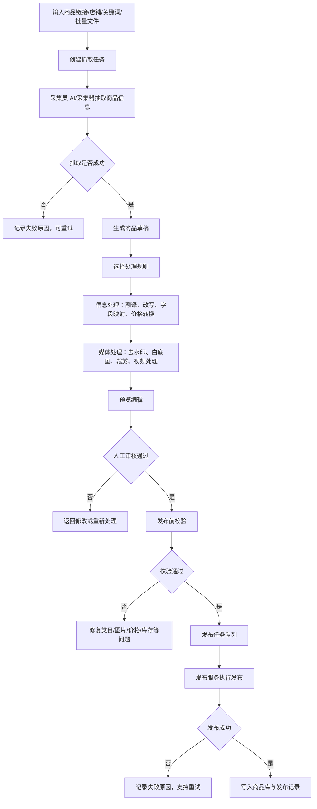

# 商品搬运工具：NocoBase 一体化产品需求与开发设计文档

版本：v0.3  
日期：2026-06-29  
建议插件包名：`@crossborder/plugin-ai-listing`  
目标平台：NocoBase `client-v2` 插件体系  
产品名称：商品搬运工具 / Cross-Border Mover
配套开发指南：`outputs/nocobase-ai-developer-official-guide.md`
配套 Phase 计划：`outputs/nocobase-ai-listing-phase-delivery-plan.md`

## 1. 背景与目标

本产品面向小白跨境电商运营人员，目标是把“看到一个好商品后手工复制、整理、改写、处理图片、填平台表单、发布商品”的流程，变成一个由工作流和 AI 员工协作完成的受控作业系统。

核心输入是商品链接、店铺链接、关键词或批量 URL。核心输出是可审核、可编辑、可发布、可追踪的商品资料与发布记录。

参考 Accio Work 的产品思路，本产品不应只是一个聊天机器人，而应是“业务数据 + 工作流 + AI 员工 + 权限 + 审核 + 发布执行”的一体化后台。NocoBase 作为主平台，负责承载数据模型、页面、权限、工作流、插件扩展、AI employee 能力；自研插件负责商品采集、商品处理、发布队列和跨平台适配。

## 2. 产品定位

一句话定位：

> 基于 NocoBase 的 AI 商品上架工作台，帮助小白电商人员从商品链接快速生成可发布的跨境商品草稿，并通过 AI 员工和工作流完成处理、审核、发布和追踪。

### 2.1 目标用户

| 用户 | 诉求 | 典型操作 |
|---|---|---|
| 小白运营 | 不懂平台规则，也能快速上架 | 粘贴商品链接，选择处理规则，审核 AI 结果，点击发布 |
| 资深运营 | 批量搬运、规则复用、失败重试 | 店铺抓取、关键词抓取、批量导入、规则维护 |
| 店铺管理员 | 管理账号、规则、权限、发布质量 | 配置平台账号、审核敏感操作、查看统计 |
| AI 员工 | 以角色身份处理表单数据 | 抽取、翻译、改写、定价、图片处理、校验、发布 |

### 2.2 MVP 范围

MVP 必须完成：

1. URL 抓取：输入单个商品链接，生成商品草稿。
2. 批量导入：上传 CSV/Excel 或粘贴 URL 列表，批量生成抓取任务。
3. 信息处理：基于规则完成标题翻译、字段映射、价格转换、图片处理。
4. 预览编辑：运营可查看 AI 生成结果，并手动修改表单字段。
5. 商品发布：支持至少一个目标平台或模拟发布通道，含发布前校验和发布记录。
6. 商品库：统一查看商品状态、来源、目标平台、发布链接、失败原因。
7. 规则管理：维护信息替换规则、图片处理规则、视频处理规则。
8. AI 员工与审计：AI 修改表单必须记录操作者、字段、旧值、新值、原因。

MVP 暂不强求：

1. 同时接入所有平台真实开放 API。
2. 完全自动绕过平台风控或登录限制。
3. 完全自动规避版权、商标、授权风险。
4. 复杂多店铺利润核算和库存同步。
5. 全量移动端适配。

## 3. 设计稿页面拆解

设计稿包含以下主导航：

| 导航 | 页面目标 |
|---|---|
| 工作台 | 总览指标、快速入口、最近任务、平台连接状态 |
| 商品抓取 | URL 抓取、店铺抓取、关键词抓取、批量导入 |
| 信息处理 | 选择规则，批量处理待处理商品，查看处理进度 |
| 预览编辑 | 查看处理后的商品详情，人工修正并标记审核 |
| 商品发布 | 配置目标平台/店铺/类目/运费模板，批量发布 |
| 商品库 | 全部商品台账，按状态、平台、批次查询 |
| 规则管理 | 信息替换、图片处理、视频处理规则维护 |
| 发布记录 | 发布结果、失败原因、目标链接、重试与导出 |
| 设置 | 平台账号、AI 模型、权限、默认参数、系统配置 |

## 4. 核心业务流程

### 4.1 端到端流程



### 4.2 商品状态机

| 状态 | 说明 | 可执行动作 |
|---|---|---|
| `capturing` | 抓取中 | 查看任务、取消 |
| `capture_failed` | 抓取失败 | 重试、删除、查看原因 |
| `captured` | 已抓取，待处理 | 处理、预览 |
| `processing` | 信息/媒体处理中 | 查看进度、取消 |
| `process_failed` | 处理失败 | 重试处理、编辑 |
| `processed` | 已处理，待审核 | 预览编辑、标记审核 |
| `review_pending` | 待审核 | 审核通过、驳回 |
| `reviewed` | 已审核，待发布 | 发布前校验、发布 |
| `publish_validating` | 发布前校验中 | 查看校验结果 |
| `publish_blocked` | 发布前校验不通过 | 修复、重新校验 |
| `publishing` | 发布中 | 查看进度 |
| `published` | 已发布 | 查看目标链接、同步状态 |
| `publish_failed` | 发布失败 | 重试、修复 |
| `archived` | 已归档 | 查看详情 |

### 4.3 功能与技术实现路径总览

本项目按 `nocobase-ai-developer-official-guide.md` 的原则实现：稳定数据和流程交给数据模型、Workflow 和插件服务；需要理解、生成、补全、解释的环节交给 AI 员工；页面尽量用 UI Builder/Modern UI 承载，只有复杂交互才做 `client-v2` 自定义区块或插件页面。

| 功能域 | 主要技术 | 辅助技术 | 是否需要插件 | AI 员工参与 | 关键验收证据 |
|---|---|---|---|---|---|
| 商品、SKU、媒体、任务、规则、发布记录 | NocoBase Data Modeling / Plugin Collections | ACL、审计日志 | MVP 建议用插件定义集合 | 无，AI 只写建议值 | 集合、字段、关联、状态机读回 |
| 工作台指标 | UI Builder 仪表盘 + JSBlock/Chart | 插件 summary API | 可先用插件 API 聚合 | 任务异常解释 | `/v2/` 页面可打开，指标能刷新 |
| URL 抓取 | 插件 API + OpenAPI adapter 优先 | Crawl4AI headless Docker 兜底、Workflow 手动触发/通知 | 必须，低代码无法稳定抓取外部页面 | 解释失败、建议来源平台 | 任务、步骤、商品草稿、原始快照 |
| 店铺抓取 | 平台 OpenAPI / 店铺商品 API 优先 | Crawl4AI 公开页面解析、分页任务、限速 | 必须 | 建议筛选范围 | 店铺分析结果、选中后任务明细 |
| 关键词抓取 | 平台搜索 OpenAPI 优先 | Crawl4AI 公开搜索页解析、去重、评分 | 必须 | 关键词扩展、爆品评分解释 | 搜索结果、选中抓取任务 |
| 批量导入 | File Manager + 插件解析 API | 服务端 job runner | 必须 | 批量异常总结 | 导入批次、成功/失败统计 |
| 信息处理 | Workflow + 处理规则集合 | AI 节点、插件规则服务 | 规则执行建议插件化 | 标题/描述/属性建议 | AI 建议值、最终值、审计记录 |
| 图片/视频处理 | 插件 media service | File Manager、外部图像服务 | 必须 | 解释失败和修复建议 | 原文件、处理后文件、处理任务 |
| 预览编辑 | UI Builder 详情/编辑表单 + 自定义预览区块 | AI Employee action | 部分需要，图片画廊/对比模式需插件区块 | 填表、改写、合规建议 | 字段差异、人工确认、审计 |
| 发布前校验 | Workflow + 插件 precheck API | Knowledge Base 平台规则 | 必须 | 解释错误、生成修复建议 | 错误清单、阻断项、通过记录 |
| 商品发布 | 插件 publish adapter + Workflow | 队列、限速、重试 | 必须 | 真实发布前只建议，不自动发布 | 发布批次、目标链接、失败原因 |
| 商品库 | UI Builder Table/GridCard | 插件详情动作 | 可先低代码 | 商品诊断 | 状态筛选、链接、重试入口 |
| 规则管理 | UI Builder CRUD + 插件导入导出 | Knowledge Base | 基础 CRUD 不需要，导入导出需要 | 生成规则草案 | 规则启用、版本、审计 |
| 发布记录 | UI Builder Table + 详情弹窗 | 插件错误码归一化 | 错误归一化需要 | 失败解释 | 发布记录、请求摘要、响应摘要 |
| AI 员工快捷任务 | AI Employees + UI Builder action | Custom tools、Knowledge Base | 工具通常由插件/Workflow 提供 | 核心能力 | 员工、工具 Ask/Allow、区块绑定 |

技术边界：

1. 能用 NocoBase 集合和 UI Builder 表达的数据维护，不优先写 React 页面。
2. 长耗时、批量、外部平台调用、图片处理、发布适配必须进入插件服务或任务队列。
3. Workflow 编排状态流转、人工确认、通知、失败重试，不承担爬虫和发布 adapter 的底层实现。
4. AI 员工只负责理解、生成、补全、解释、辅助填写；真实发布、删除、批量修改默认需要 `Ask` 和审计。
5. RunJS 只用于页面局部增强和原型验证，不承载核心后端任务或权限逻辑。

## 5. 功能需求

### 5.1 工作台

对应设计稿：工作台 Dashboard。

功能要求：

| 模块 | 需求 |
|---|---|
| KPI 卡片 | 显示今日抓取、待处理、已发布、发布成功率 |
| 快速操作 | 入口包括 URL 抓取、店铺抓取、关键词抓取、批量导入 |
| 平台连接状态 | 显示 Shopee、Lazada、Temu、TikTok Shop 等连接/未连接/凭证过期 |
| 最近任务 | 展示任务名称、类型、进度、状态、创建时间 |
| 通知入口 | 平台授权过期、发布失败、规则异常时展示提醒 |

优化建议：

1. 增加“今日待人工确认”指标，避免小白不知道下一步做什么。
2. 最近任务支持点击进入对应任务详情，而不是只展示进度。
3. 平台连接状态应支持一键跳转到设置页重新授权。

### 5.2 商品抓取

商品抓取包含四种模式：URL 抓取、店铺抓取、关键词抓取、批量导入。

#### 5.2.1 URL 抓取

对应设计稿：商品抓取-Capture。

功能要求：

| 功能 | 需求 |
|---|---|
| 商品链接输入 | 支持 Shopee、Lazada、Amazon、Temu、TikTok Shop 等链接 |
| 来源平台 | 支持自动识别和手动指定 |
| 抓取内容 | 可选商品主图、详情图片、商品视频、SKU 信息、商品评价 |
| 开始抓取 | 点击后创建抓取任务并进入任务队列 |
| 抓取历史 | 显示商品信息、来源平台、价格、库存、状态、抓取时间、操作 |
| 失败处理 | 抓取失败时展示失败原因，支持重试和删除 |

校验规则：

1. 商品链接必填。
2. 平台自动识别失败时要求用户选择来源平台。
3. 同一链接重复抓取时提示“已存在草稿”，允许覆盖或新建版本。

#### 5.2.2 店铺抓取

对应设计稿：商品抓取-店铺抓取。

功能要求：

| 功能 | 需求 |
|---|---|
| 店铺链接输入 | 输入店铺首页或商品列表页 URL |
| 分析店铺 | 识别店铺结构、商品数量、分类、分页 |
| 抓取范围 | 全部商品、指定分类、前 N 个商品 |
| 筛选条件 | 价格区间、仅抓有库存商品、排序方式 |
| 店铺分析结果 | 展示商品列表，包含图片、标题、SKU、类目、价格、销量、库存、评分 |
| 批量抓取选中 | 选中商品后批量生成抓取任务 |

优化建议：

1. 店铺分析和商品抓取分成两步，避免误抓全店大量商品。
2. 增加“按销量/评分/新品/库存”排序，帮助小白优先选潜力商品。
3. 批量抓取前显示预计耗时和平台风控提醒。

#### 5.2.3 关键词抓取

对应设计稿：商品抓取-关键词抓取。

功能要求：

| 功能 | 需求 |
|---|---|
| 关键词输入 | 支持多个关键词标签 |
| 来源平台 | 支持选择 Shopee、Lazada、Amazon、Temu |
| 抓取数量上限 | 支持 50、100、200、自定义 |
| 排序方式 | 综合排序、按销量、价格低到高、价格高到低、最新发布 |
| 筛选条件 | 价格区间、发货地、店铺类型、仅显示有库存 |
| 保存搜索条件 | 将关键词和筛选条件保存为规则 |
| 搜索结果 | 商品卡片展示图片、标题、价格、销量、评分、平台 |
| 批量抓取选中 | 支持选中后批量抓取 |

优化建议：

1. 增加“相似度去重”，避免同款商品重复进入待处理池。
2. 增加“爆品评分”，基于销量、评分、价格、评价数给出排序建议。

#### 5.2.4 批量导入

对应设计稿：商品抓取-批量导入。

功能要求：

| 功能 | 需求 |
|---|---|
| 导入方式 | 文件上传和文本粘贴 |
| 文件格式 | 支持 CSV、Excel `.xlsx`，单文件最大 10MB |
| 文本粘贴 | 每行一个 URL |
| 模板下载 | 提供 CSV 模板和 Excel 模板 |
| 抓取内容 | 可选主图、详情图、视频、SKU |
| 开始导入并抓取 | 解析 URL 列表后批量创建抓取任务 |
| 导入历史 | 显示文件名、导入方式、URL 数量、成功/失败、状态、导入时间、操作 |

导入模板字段：

| 字段 | 必填 | 说明 |
|---|---|---|
| `url` | 是 | 商品链接 |
| `sourcePlatform` | 否 | 来源平台，缺省自动识别 |
| `targetPlatform` | 否 | 目标平台 |
| `remark` | 否 | 备注 |
| `ruleCode` | 否 | 指定处理规则 |

### 5.3 信息处理

对应设计稿：信息处理 Process、增强版。

功能要求：

| 功能 | 需求 |
|---|---|
| 选择处理规则 | 展示可用规则卡片，如 Shopee -> Lazada 东南亚、Amazon -> Temu 美国、通用快速处理 |
| 待处理商品 | 展示商品信息、来源平台、原始价格、抓取时间、状态、操作 |
| 批量处理 | 选中商品后按规则批量处理 |
| 处理进度 | 展示总体进度、已完成数、当前阶段 |
| 阶段状态 | 参数替换、图片 AI 处理、视频处理、信息存档 |
| 媒体处理明细 | 展示图片/视频数量、处理类型分布、成功率、文件处理明细 |

处理规则能力：

1. 标题自动翻译与改写。
2. 价格汇率转换和加价策略。
3. 品牌、产地、材质、颜色等字段映射。
4. 图片去水印、白底图、场景图生成、尺寸裁剪。
5. 视频去水印、裁剪、封面提取。
6. 敏感词、侵权词、禁售词校验。

优化建议：

1. 增加“处理前/处理后差异对比”，让小白知道 AI 改了什么。
2. 对高风险字段增加人工确认，例如品牌、商标、授权、功效词。
3. 媒体处理失败不应阻塞全部流程，可标记为“需人工修复”。

### 5.4 预览编辑

对应设计稿：预览编辑 Preview。

功能要求：

| 功能 | 需求 |
|---|---|
| 商品列表 | 左侧显示已处理商品，支持搜索、状态筛选、平台筛选、批量选择 |
| 商品详情 | 右侧展示图片、标题、价格、库存、SKU、描述、参数 |
| 图片预览 | 支持主图、缩略图切换 |
| 字段编辑 | 标题、价格、库存、SKU、描述、参数均可编辑 |
| 审核标记 | 运营可标记“已审核” |
| 预览模式 | PC 端、移动端、对比模式 |
| 变更记录 | 每次手动编辑或 AI 修改都记录旧值、新值、操作者、原因 |

字段编辑原则：

1. 表单字段必须区分来源值、AI 处理值、人工最终值。
2. AI 修改内容应带标签，例如“已替换”“AI 改写”“人工修改”。
3. 审核通过后关键字段默认锁定，重新编辑需回退状态。

### 5.5 商品发布

对应设计稿：商品发布 Publish。

功能要求：

| 功能 | 需求 |
|---|---|
| 目标平台 | 选择 Lazada、Shopee、Temu、TikTok Shop |
| 目标店铺 | 选择已授权店铺 |
| 发布类目 | 选择目标平台类目 |
| 运费模板 | 选择店铺运费模板 |
| 发布策略 | 立即发布、定时发布、放入草稿箱 |
| 发布速率 | 标准、快速、安全 |
| 待发布商品 | 展示商品、目标价格、库存、校验状态、处理时间、操作 |
| 发布前校验 | 检查类目、图片、标题、价格、库存、SKU、禁售词 |
| 批量发布 | 通过校验的商品进入发布队列 |
| 发布进度 | 展示发布成功、发布中、发布失败、等待中数量 |

发布前校验规则：

| 校验项 | 阻断条件 |
|---|---|
| 目标店铺 | 未授权或凭证过期 |
| 类目 | 未设置目标平台类目 |
| 图片 | 主图缺失、尺寸不合规、数量不足 |
| 标题 | 超长、为空、包含禁用词 |
| 价格 | 为空、低于成本、超出平台限制 |
| 库存 | 为空、为 0 或小于安全库存 |
| SKU | 规格不完整、价格/库存缺失 |
| 合规 | 品牌授权、禁售品、敏感词风险 |

### 5.6 商品库

对应设计稿：商品库 Products。

功能要求：

| 功能 | 需求 |
|---|---|
| 统计卡片 | 全部商品、已抓取、已处理、已发布、发布失败 |
| 搜索筛选 | 商品名称、ID、SKU、状态、平台、批次、高级筛选 |
| 商品列表 | 商品信息、来源平台、目标平台、价格、状态、发布链接、更新时间、操作 |
| 视图切换 | 列表视图和卡片视图 |
| 导出 | 导出商品资料或筛选结果 |
| 操作 | 详情、去发布、去处理、重试、更多 |

商品库不是简单结果页，而是整个系统的主数据台账。所有抓取、处理、发布动作都应最终回写商品库状态。

### 5.7 规则管理

对应设计稿：规则管理 Rules、完整版。

功能要求：

| 功能 | 需求 |
|---|---|
| 规则类型 | 信息替换规则、图片处理规则、视频处理规则 |
| 平台筛选 | 全部平台、Shopee、Lazada、Amazon、Temu、TikTok Shop |
| 规则卡片 | 展示规则名称、来源/目标平台、更新时间、启用状态 |
| 模块开关 | 文本翻译、价格转换、字段映射可单独开关 |
| 替换映射表 | 支持源字段、匹配规则、目标字段、替换值、类型 |
| 规则操作 | 新建、编辑、复制、启用/禁用、导入、导出 |

规则数据建议：

| 类型 | 示例 |
|---|---|
| 固定替换 | 品牌任意值 -> AudioTech |
| 精确匹配 | 产地 Trung Quốc -> Shenzhen, China |
| 字段映射 | 颜色分类 -> 规格 |
| 翻译规则 | 越南语 -> 英语 |
| 价格规则 | VND -> USD，统一加价 30% |
| 图片规则 | 去水印 + 白底图 + 场景图 |

### 5.8 发布记录

对应设计稿：发布记录 History。

功能要求：

| 功能 | 需求 |
|---|---|
| 统计卡片 | 总发布次数、发布成功、发布失败、今日发布 |
| 筛选 | 商品名称、ID、批次号、状态、平台、日期 |
| 发布记录列表 | 批次/商品信息、目标平台、发布结果、目标链接、失败原因、发布时间、操作 |
| 批量重试失败项 | 对失败记录按原因重试 |
| 导出报告 | 导出发布结果和失败原因 |
| 详情 | 查看请求参数、平台响应、错误日志、操作者 |

## 6. AI 员工设计

AI 员工不是独立聊天角色，而是工作流中的可审计业务角色。每个 AI 员工只能通过被授权的工具读写数据。

| AI 员工 | 职责 | 可读 | 可写 | 人工确认点 |
|---|---|---|---|---|
| 商品采集员 | 从 URL/店铺/关键词抽取商品信息 | 抓取任务、来源页面快照 | 原始商品、资产、抓取日志 | 反爬、登录、采集失败 |
| 信息整理员 | 清洗标题、描述、参数、SKU | 原始商品、规则 | 商品草稿字段 | 品牌、功效词、授权词 |
| 翻译本地化员 | 翻译与本地化文案 | 标题、描述、参数、提示词模板 | 标题、描述、卖点 | 高风险文案 |
| 定价员 | 汇率、加价、利润估算 | 原价、汇率、规则、目标平台 | 目标售价、划线价、利润字段 | 价格低于成本、异常高价 |
| 媒体处理员 | 图片/视频去水印、裁剪、白底图 | 商品资产 | 处理后资产、媒体任务 | 生成图失败、疑似侵权 |
| 合规审核员 | 检查禁售词、敏感词、类目风险 | 商品草稿、规则、平台限制 | 校验结果、风险标签 | 禁售、商标、授权 |
| 发布助理 | 发布前检查、失败解释、重试建议 | 已审核商品、账号配置、发布记录 | 校验结果、修复建议 | 真实发布动作 |

权限原则：

1. AI 员工访问数据默认跟随当前用户权限。
2. 自定义工作流工具必须单独做业务校验和审计。
3. AI 不能直接删除商品、删除发布记录、修改平台账号密钥。
4. 发布助理不能绕过人工确认直接真实发布；真实发布必须满足人工审核、发布前校验和角色权限。
5. 所有 AI 写入字段必须写入 `aiListingAuditLogs`。

AI 工具权限约定：

| 工具 | 权限 | 数据变更 | 说明 |
|---|---|---|---|
| 查询商品/任务/发布记录 | `Allow` | 否 | 仍需遵循当前用户权限 |
| 生成标题/描述/卖点建议 | `Allow` | 否 | 输出到建议区，不直接覆盖最终字段 |
| 填写表单建议值 | `Ask` | 是 | 用户确认后写入处理字段或最终字段 |
| 发布前校验 | `Allow` | 否 | 可直接运行，输出阻断项和警告 |
| 启动抓取/处理任务 | `Ask` | 是 | 创建任务和任务步骤，需要审计 |
| 真实发布商品 | `Ask` | 是 | 只允许已审核且校验通过的商品 |
| 删除商品/规则/发布记录 | 禁止 | 是 | 不提供给 AI 员工 |

AI 员工绑定方式：

1. 记录详情页绑定“优化标题”“补全参数”“生成描述”“发布前检查”。
2. 列表批量操作只允许“批量分析/建议/解释”，不直接批量写核心字段。
3. 规则页允许“生成规则草案”，规则启用仍由人工完成。
4. 发布页允许“解释失败”“生成修复步骤”，真实发布按钮保持人工操作。

## 7. NocoBase 实现架构

### 7.0 总体技术边界

本系统不建议做成独立 SaaS 后台后再嵌入 NocoBase，也不建议把所有页面都写成自定义 React。推荐架构是：

```text
NocoBase 主平台
├─ Data Modeling / Plugin Collections：业务数据模型
├─ UI Builder：大部分表格、表单、详情、筛选、操作
├─ Workflow：任务编排、状态流转、人工确认、通知、失败重试
├─ AI Employees：标题、描述、参数、类目、失败解释等智能协作
├─ Knowledge Base：平台规则、类目规则、禁售词、标题规范
└─ @crossborder/plugin-ai-listing：采集、媒体处理、发布适配、复杂区块、聚合 API
```

技术选型原则：

| 能力 | 默认技术 | 进入插件开发的条件 |
|---|---|---|
| 表、字段、关联、枚举、基础 CRUD | Data Modeling / Plugin Collections | 需要随插件安装自动创建核心业务表 |
| 普通列表、详情、编辑、筛选 | UI Builder | 需要复杂画廊、对比预览、批量任务进度 |
| 状态流转、通知、人工确认 | Workflow | 需要新触发器/节点类型或复杂外部任务 |
| 单链接/店铺/关键词/批量抓取 | Plugin Service | 必须插件化 |
| 图片/视频处理 | Plugin Service + File Manager | 必须插件化 |
| 平台发布 | Plugin Publish Adapter + Workflow | 必须插件化 |
| 标题/描述/参数生成 | AI Employees + Workflow AI 节点 | 需要自定义工具时由插件/工作流提供工具 |
| 平台规则问答 | Knowledge Base / RAG | 外部知识库才做知识库插件开发 |
| 局部页面 JS 展示 | RunJS | 不得承担核心业务服务 |

### 7.1 插件边界

建议做一个主插件：

```text
@crossborder/plugin-ai-listing
```

插件职责：

1. 定义商品搬运相关业务表。
2. 注册自定义 API action 和服务端 job runner。
3. 注册必要的 `client-v2` 自定义区块、页面或设置页。
4. 对接 NocoBase Workflow、File Manager、AI Employees、Knowledge Base、ACL。
5. 封装采集器、处理器、发布器的服务端接口。

插件不负责：

1. 代替 UI Builder 搭所有普通 CRUD 页面。
2. 代替 Workflow 管理所有状态流转。
3. 代替 ACL 做前端隐藏式权限控制。
4. 让 AI 员工绕过人工确认执行高风险写操作。

后续如果规模变大，可拆分为：

| 插件 | 职责 |
|---|---|
| `@crossborder/plugin-ai-listing-core` | 商品、任务、规则、发布记录主数据 |
| `@crossborder/plugin-ai-listing-capture` | URL、店铺、关键词、批量导入抓取 |
| `@crossborder/plugin-ai-listing-connectors` | Shopee/Lazada/Temu/TikTok Shop 平台连接器 |
| `@crossborder/plugin-ai-listing-media` | 图片/视频处理 |
| `@crossborder/plugin-ai-listing-publish` | 发布适配器、限速、重试、错误码归一化 |
| `@crossborder/plugin-ai-listing-ai` | AI 员工工具、提示词、Knowledge Base 绑定 |
| `@crossborder/plugin-ai-listing-ui` | 复杂 client-v2 区块和页面 |

MVP 阶段建议先做单插件，减少集成成本。

### 7.2 插件目录结构

```text
packages/plugins/@crossborder/plugin-ai-listing/
├── package.json
├── src/
│   ├── index.ts
│   ├── server/
│   │   ├── index.ts
│   │   ├── plugin.ts
│   │   ├── collections/
│   │   │   ├── aiListingProducts.ts
│   │   │   ├── aiListingSkus.ts
│   │   │   ├── aiListingMediaAssets.ts
│   │   │   ├── aiListingCaptureTasks.ts
│   │   │   ├── aiListingTaskSteps.ts
│   │   │   ├── aiListingRules.ts
│   │   │   ├── aiListingProcessingJobs.ts
│   │   │   ├── aiListingMediaJobs.ts
│   │   │   ├── aiListingPublishBatches.ts
│   │   │   ├── aiListingPublishRecords.ts
│   │   │   ├── aiListingPlatformAccounts.ts
│   │   │   └── aiListingAuditLogs.ts
│   │   ├── actions/
│   │   ├── resources/
│   │   ├── services/
│   │   ├── adapters/
│   │   ├── jobs/
│   │   ├── workflows/
│   │   ├── acl/
│   │   └── migrations/
│   ├── client-v2/
│   │   ├── index.tsx
│   │   ├── plugin.tsx
│   │   ├── locale.ts
│   │   ├── routes/
│   │   ├── pages/
│   │   │   ├── DashboardPage.tsx
│   │   │   ├── CapturePage.tsx
│   │   │   ├── ProcessPage.tsx
│   │   │   ├── PreviewPage.tsx
│   │   │   ├── PublishPage.tsx
│   │   │   ├── ProductsPage.tsx
│   │   │   ├── RulesPage.tsx
│   │   │   ├── HistoryPage.tsx
│   │   │   └── SettingsPage.tsx
│   │   ├── components/
│   │   ├── blocks/
│   │   ├── actions/
│   │   ├── models/
│   │   └── hooks/
│   └── locale/
│       ├── zh-CN.json
│       └── en-US.json
```

NocoBase 约束：

1. 所有客户端代码写在 `src/client-v2/`。
2. 客户端插件从 `@nocobase/client-v2` 导入 `Plugin`。
3. 页面使用 `this.router.add()` 注册，访问路径在 `/v2/` 下。
4. 设置页使用 `pluginSettingsManager.addMenuItem()` 和 `addPageTabItem()`。
5. 不使用 `this.app.use()` 和 React Provider。
6. 服务端 collection 用 `defineCollection()`。
7. 自定义接口用 `resourceManager.registerActionHandlers()` 或 `resourceManager.define()`。
8. ACL 在服务端 `load()` 中注册。

### 7.3 前端路由建议

| 页面 | 路由 | 说明 |
|---|---|---|
| 工作台 | `/v2/ai-listing/dashboard` | 指标与任务总览 |
| 商品抓取 | `/v2/ai-listing/capture` | 四种抓取模式 |
| 信息处理 | `/v2/ai-listing/process` | 规则与处理队列 |
| 预览编辑 | `/v2/ai-listing/preview` | 商品草稿审核编辑 |
| 商品发布 | `/v2/ai-listing/publish` | 发布配置与执行 |
| 商品库 | `/v2/ai-listing/products` | 商品主数据台账 |
| 规则管理 | `/v2/ai-listing/rules` | 处理规则 |
| 发布记录 | `/v2/ai-listing/history` | 发布结果 |
| 设置 | `/v2/admin/settings/ai-listing` | 平台账号、AI、默认参数 |

### 7.4 数据模型设计

#### 7.4.1 `aiListingProducts`

商品主表。

| 字段 | 类型 | 说明 |
|---|---|---|
| `id` | bigInt | 主键 |
| `productNo` | uid/string | 商品编号 |
| `sourcePlatform` | string | 来源平台 |
| `sourceUrl` | text | 来源链接 |
| `sourceProductId` | string | 来源商品 ID |
| `targetPlatform` | string | 目标平台 |
| `targetStoreId` | bigInt | 目标店铺 |
| `titleOriginal` | string | 原始标题 |
| `titleProcessed` | string | AI 处理标题 |
| `titleFinal` | string | 最终标题 |
| `descriptionOriginal` | long text | 原始描述 |
| `descriptionProcessed` | long text | AI 处理描述 |
| `descriptionFinal` | long text | 最终描述 |
| `priceOriginal` | decimal | 原价 |
| `currencyOriginal` | string | 原币种 |
| `priceTarget` | decimal | 目标售价 |
| `listPriceTarget` | decimal | 划线价 |
| `stock` | integer | 库存 |
| `categoryOriginal` | string | 来源类目 |
| `categoryTargetId` | string | 目标平台类目 |
| `attributesOriginal` | jsonb | 原始参数 |
| `attributesProcessed` | jsonb | 处理后参数 |
| `riskFlags` | jsonb | 风险标签 |
| `status` | string | 商品状态 |
| `reviewStatus` | string | 审核状态 |
| `createdById` | bigInt | 创建人 |
| `updatedById` | bigInt | 更新人 |

#### 7.4.2 `aiListingSkus`

SKU/变体表。

| 字段 | 类型 | 说明 |
|---|---|---|
| `id` | bigInt | 主键 |
| `productId` | belongsTo | 关联商品 |
| `sku` | string | SKU |
| `specName` | string | 规格名，如颜色/尺码 |
| `specValue` | string | 规格值，如黑色/L |
| `priceOriginal` | decimal | 原价 |
| `priceTarget` | decimal | 目标价 |
| `stock` | integer | 库存 |
| `imageAssetId` | bigInt | SKU 图片 |
| `status` | string | 状态 |

#### 7.4.3 `aiListingMediaAssets`

图片/视频资产表。

| 字段 | 类型 | 说明 |
|---|---|---|
| `id` | bigInt | 主键 |
| `productId` | belongsTo | 关联商品 |
| `assetType` | string | image/video |
| `sourceUrl` | text | 来源资源 URL |
| `sourceFileId` | bigInt | 原文件 |
| `processedFileId` | bigInt | 处理后文件 |
| `role` | string | main/detail/sku/video |
| `sort` | integer | 排序 |
| `processStatus` | string | pending/running/success/failed |
| `processType` | string | 去水印/白底图/裁剪/场景图 |
| `meta` | jsonb | 尺寸、大小、时长等 |

#### 7.4.4 `aiListingCaptureTasks`

抓取任务表。

| 字段 | 类型 | 说明 |
|---|---|---|
| `id` | bigInt | 主键 |
| `taskNo` | uid/string | 任务编号 |
| `captureType` | string | url/store/keyword/batch |
| `sourcePlatform` | string | 来源平台 |
| `input` | jsonb | URL、关键词、筛选条件、文件信息 |
| `options` | jsonb | 抓取内容选项 |
| `status` | string | pending/running/success/partial_failed/failed |
| `totalCount` | integer | 总数 |
| `successCount` | integer | 成功 |
| `failedCount` | integer | 失败 |
| `progress` | integer | 进度 |
| `errorMessage` | text | 失败原因 |
| `createdById` | bigInt | 创建人 |

#### 7.4.5 `aiListingTaskSteps`

任务步骤明细表。URL 抓取、店铺抓取、关键词抓取、批量导入、信息处理、媒体处理、发布都应写入步骤，便于展示进度和失败原因。

| 字段 | 类型 | 说明 |
|---|---|---|
| `id` | bigInt | 主键 |
| `taskType` | string | capture/process/media/publish/import |
| `taskId` | bigInt | 关联任务 ID |
| `productId` | belongsTo | 生成商品 |
| `stepName` | string | analyze_url/download_media/normalize/save_product 等 |
| `sourceUrl` | text | 商品链接 |
| `status` | string | pending/running/success/failed/skipped |
| `inputSnapshot` | jsonb | 步骤输入摘要 |
| `outputSnapshot` | jsonb | 步骤输出摘要 |
| `rawSnapshot` | jsonb | 来源页面抽取快照，抓取步骤使用 |
| `errorMessage` | text | 失败原因 |
| `durationMs` | integer | 耗时 |

#### 7.4.6 `aiListingRules`

处理规则表。

| 字段 | 类型 | 说明 |
|---|---|---|
| `id` | bigInt | 主键 |
| `ruleCode` | string | 规则编码 |
| `name` | string | 规则名称 |
| `ruleType` | string | info/image/video |
| `sourcePlatform` | string | 来源平台 |
| `targetPlatform` | string | 目标平台 |
| `enabled` | boolean | 是否启用 |
| `config` | jsonb | 翻译、价格、字段映射、媒体处理配置 |
| `mappingRows` | jsonb | 替换映射表 |
| `promptTemplate` | text | AI 提示词模板 |
| `updatedById` | bigInt | 更新人 |

#### 7.4.7 `aiListingProcessingJobs`

处理任务表。

| 字段 | 类型 | 说明 |
|---|---|---|
| `id` | bigInt | 主键 |
| `jobNo` | uid/string | 处理批次号 |
| `ruleId` | belongsTo | 使用规则 |
| `productIds` | jsonb | 商品 ID 列表 |
| `status` | string | pending/running/success/partial_failed/failed |
| `currentStage` | string | 参数替换/图片处理/视频处理/信息存档 |
| `totalCount` | integer | 总数 |
| `successCount` | integer | 成功 |
| `failedCount` | integer | 失败 |
| `progress` | integer | 进度 |
| `logs` | jsonb | 处理日志 |

#### 7.4.8 `aiListingMediaJobs`

媒体处理任务表。

| 字段 | 类型 | 说明 |
|---|---|---|
| `id` | bigInt | 主键 |
| `productId` | belongsTo | 商品 |
| `assetId` | belongsTo | 资产 |
| `jobType` | string | remove_watermark/white_bg/crop/scene/video |
| `status` | string | 状态 |
| `inputFileId` | bigInt | 输入文件 |
| `outputFileId` | bigInt | 输出文件 |
| `durationMs` | integer | 耗时 |
| `errorMessage` | text | 错误 |

#### 7.4.9 `aiListingPublishBatches`

发布批次表。

| 字段 | 类型 | 说明 |
|---|---|---|
| `id` | bigInt | 主键 |
| `batchNo` | uid/string | 批次号 |
| `targetPlatform` | string | 目标平台 |
| `targetStoreId` | bigInt | 目标店铺 |
| `categoryTargetId` | string | 目标类目 |
| `shippingTemplateId` | string | 运费模板 |
| `strategy` | string | immediate/scheduled/draft |
| `speedMode` | string | standard/fast/safe |
| `status` | string | pending/running/success/partial_failed/failed |
| `totalCount` | integer | 总数 |
| `successCount` | integer | 成功 |
| `failedCount` | integer | 失败 |
| `scheduledAt` | datetime | 定时发布时间 |

#### 7.4.10 `aiListingPublishRecords`

发布记录表。

| 字段 | 类型 | 说明 |
|---|---|---|
| `id` | bigInt | 主键 |
| `batchId` | belongsTo | 发布批次 |
| `productId` | belongsTo | 商品 |
| `targetPlatform` | string | 目标平台 |
| `targetStoreId` | bigInt | 目标店铺 |
| `result` | string | success/failed |
| `targetProductId` | string | 平台商品 ID |
| `targetUrl` | text | 目标链接 |
| `failureReason` | text | 失败原因 |
| `requestPayload` | jsonb | 发布请求摘要 |
| `responsePayload` | jsonb | 平台响应摘要 |
| `publishedAt` | datetime | 发布时间 |

#### 7.4.11 `aiListingPlatformAccounts`

平台账号表。

| 字段 | 类型 | 说明 |
|---|---|---|
| `id` | bigInt | 主键 |
| `platform` | string | 平台 |
| `storeName` | string | 店铺名 |
| `authStatus` | string | connected/expired/disconnected |
| `credentialRef` | encryption/string | 凭证引用，不明文展示 |
| `expiresAt` | datetime | 过期时间 |
| `settings` | jsonb | 平台配置 |

#### 7.4.12 `aiListingAuditLogs`

审计日志表。

| 字段 | 类型 | 说明 |
|---|---|---|
| `id` | bigInt | 主键 |
| `actorType` | string | user/ai_employee/system |
| `actorId` | string | 用户 ID 或 AI 员工 ID |
| `action` | string | 动作 |
| `resourceType` | string | product/rule/publish/account |
| `resourceId` | bigInt | 资源 ID |
| `fieldName` | string | 字段名 |
| `oldValue` | jsonb | 旧值 |
| `newValue` | jsonb | 新值 |
| `reason` | text | 修改原因 |
| `createdAt` | datetime | 时间 |

### 7.5 自定义 API 设计

NocoBase 使用 `resource:action` 形式。

| API | 方法 | 用途 |
|---|---|---|
| `aiListingCapture:startUrlCapture` | POST | 创建 URL 抓取任务 |
| `aiListingCapture:analyzeStore` | POST | 分析店铺商品列表 |
| `aiListingCapture:startStoreCapture` | POST | 按选择结果创建店铺抓取任务 |
| `aiListingCapture:searchKeyword` | POST | 搜索关键词结果 |
| `aiListingCapture:startKeywordCapture` | POST | 批量抓取关键词选中商品 |
| `aiListingBatchImport:parse` | POST | 解析上传文件或文本 |
| `aiListingBatchImport:start` | POST | 创建批量抓取任务 |
| `aiListingTasks:getProgress` | GET | 查询抓取/处理/发布任务进度 |
| `aiListingProcessing:runRule` | POST | 对商品执行处理规则 |
| `aiListingProcessing:retry` | POST | 重试处理失败项 |
| `aiListingMedia:compare` | GET | 获取媒体处理前后对比 |
| `aiListingProducts:approveDraft` | POST | 标记商品草稿已审核 |
| `aiListingProducts:rollbackReview` | POST | 取消审核，回到待编辑 |
| `aiListingPublish:precheck` | POST | 发布前校验 |
| `aiListingPublish:publish` | POST | 启动发布或模拟发布批次 |
| `aiListingPublish:retryFailed` | POST | 重试失败发布项 |
| `aiListingReports:exportPublish` | POST | 导出发布报告 |
| `aiListingDashboard:summary` | GET | 工作台指标 |

统一返回结构：

```json
{
  "ok": true,
  "data": {},
  "warnings": [],
  "errors": [],
  "traceId": "string"
}
```

失败返回必须能被页面和 AI 员工解释：

```json
{
  "ok": false,
  "errors": [
    {
      "code": "CATEGORY_MISSING",
      "message": "发布类目未选择",
      "field": "categoryTargetId",
      "recoverable": true
    }
  ],
  "traceId": "string"
}
```

API 权限要求：

1. 查询类 API 遵循当前用户 ACL。
2. 创建任务、修改商品、发布相关 API 必须写审计日志或任务步骤。
3. 平台凭证只允许服务端读取，前端和 AI 员工只能拿到连接状态。
4. `aiListingPublish:publish` 默认只支持模拟发布；接入真实平台前必须增加店铺授权、幂等和限速校验。

### 7.6 工作流设计

建议组合使用 NocoBase Workflow 和插件服务端任务。

| 场景 | 实现方式 |
|---|---|
| 单 URL 抓取 | 自定义 action 触发 Workflow，调用插件 `aiListingCapture:startUrlCapture`，服务端 job runner 写任务步骤 |
| 商品创建后自动进入待处理 | Collection event workflow，只处理单条状态初始化 |
| 信息处理 | 手动 action 触发 Workflow，调用 `aiListingProcessing:runRule`，AI 节点生成建议值 |
| 媒体处理 | 插件服务端 job runner，Workflow 只负责发起、等待、通知 |
| 商品审核通过后允许发布 | 自定义 action 或 Workflow 人工处理节点 |
| 发布前校验 | Workflow 调用 `aiListingPublish:precheck`，返回阻断项和警告 |
| 商品发布 | Workflow 调用 `aiListingPublish:publish`，插件发布适配器执行限速和幂等 |
| 批量抓取/处理/发布 | 插件服务端 job runner 显式创建任务明细，不依赖 collection event 批量触发 |
| 发布失败通知 | Workflow notification node |
| 高风险商品人工审核 | Workflow approval/manual processing |
| AI 员工处理字段 | Workflow AI Employee node 或插件自定义工具 |

注意：NocoBase collection event 文档说明批量数据操作不会逐条触发 collection event。因此批量导入、批量处理、批量发布必须由插件服务端显式创建任务明细和状态，不能只依赖 collection event 自动触发。

核心工作流清单：

| 工作流 | 触发 | 关键节点 | 是否自动启用 |
|---|---|---|---|
| `wf_url_capture` | 用户点击开始抓取 | 创建任务 -> 插件抓取 -> 标准化 -> 保存草稿 -> 通知 | 否，开发验证后启用 |
| `wf_batch_import_capture` | 批量导入确认 | 解析结果 -> 循环创建任务步骤 -> 汇总成功失败 | 否 |
| `wf_product_processing` | 选中商品点击批量处理 | 读取规则 -> AI 结构化输出 -> 字段映射 -> 媒体任务 -> 审计 | 否 |
| `wf_publish_precheck` | 发布前校验按钮 | 字段校验 -> 媒体校验 -> 规则/知识库校验 -> 输出错误 | 可启用 |
| `wf_product_publish` | 人工确认发布 | 限速 -> 插件发布 -> 写发布记录 -> 失败通知 | 否，真实平台接入后启用 |
| `wf_publish_failure_diagnosis` | 发布失败后 | 错误码归一化 -> AI 解释 -> 生成修复建议 | 可启用 |

工作流开发约束：

1. 新建工作流默认 `enabled=false`，启用前必须经过测试和人工确认。
2. 节点按顺序创建，不能并发创建节点。
3. 节点变量引用使用节点 `key`，不使用节点数字 `id`。
4. 已执行过的工作流版本要先创建 revision，再修改。
5. 每个工作流至少要有一次成功执行和一次失败路径验证。

### 7.7 权限设计

系统角色建议：

| 角色 | 权限 |
|---|---|
| 超级管理员 | 全部配置、账号、规则、发布、审计 |
| 店铺管理员 | 管理平台账号、发布配置、规则、审核 |
| 运营人员 | 抓取、处理、预览编辑、提交审核 |
| 审核人员 | 审核商品、驳回、允许发布 |
| 只读观察者 | 查看商品库、发布记录和报表 |
| AI 员工 | 通过工具执行受控读写，无 UI 登录权限 |

关键权限点：

1. 平台账号凭证只有管理员可配置。
2. 运营可抓取和编辑草稿，但不能跳过审核直接发布。
3. 审核人员可标记审核通过。
4. 发布助理只能对已审核且校验通过的商品给出发布建议或发起需确认的发布工具。
5. 规则修改需记录审计日志。
6. AI 员工执行数据查询默认跟随当前用户权限；自定义工具必须做业务校验。

### 7.8 使用 NocoBase 官方 skills 的开发执行规范

后续用 Codex、Claude Code、Cursor 等 AI Agent 进入实际开发时，必须先阅读并遵守 `outputs/nocobase-ai-developer-official-guide.md`，并优先使用 NocoBase 官方 `https://github.com/nocobase/skills` 仓库中的 skills。不要把所有需求都交给 `nocobase-plugin-development`，而是按任务类型选择正确开发路径。

官方 skills 是给开发 Agent 使用的领域知识包；产品内 AI Employees 的 `Skills` 是给业务 AI 员工使用的预置能力。两者不能混用。

| 开发任务 | 优先 skill / 能力 | 说明 |
|---|---|---|
| NocoBase 环境启动、升级、初始化 | `nocobase-env-manage` | 只处理实例环境，不做业务开发 |
| 建表、字段、关系、视图表 | `nocobase-data-modeling` | 先读现有集合，避免重复建模 |
| v2 页面、区块、操作、AI 员工按钮 | `nocobase-ui-builder` | 走 `flow-surfaces`，不直接写内部 schema |
| 根据设计稿或截图复刻页面 | `nocobase-prototype-repro` | 仅在明确要求还原原型时使用，并做截图对比 |
| 工作流创建、修订、诊断 | `nocobase-workflow-manage` | 新工作流默认禁用，节点按顺序创建 |
| 角色、权限、用户授权 | `nocobase-acl-manage` | 高风险写操作必须确认并读回 |
| AI 员工创建、复用、工具配置 | `nocobase-ai-employee` | 先判断是否真的需要 AI，不替代确定性按钮 |
| 插件脚手架、API、client-v2 区块 | `nocobase-plugin-development` | 先确认方案，再 scaffold 或改插件 |
| 插件启用/停用 | `nocobase-plugin-manage` | 启停后读回校验 |
| 备份、迁移、发布 | `nocobase-publish-manage` | 生产环境必须确认备份和回滚 |
| 阶段性版本快照 | `nocobase-revision` | 每个可验收里程碑完成后保存可恢复版本 |
| 通知模板和渠道 | `nocobase-notification-manage` | 发布成功、发布失败、任务完成提醒用 |
| 数据统计和指标核对 | `nocobase-data-analysis` | 工作台 KPI、发布成功率、失败原因分析用 |
| 表达式、过滤条件、UID、计算函数 | `nocobase-utils` | workflow 条件、前端联动、过滤器配置时使用 |
| YAML/DSL 整体应用构建 | `nocobase-dsl-reconciler` | 仅在明确要求 DSL/YAML/Git 化配置时使用 |

当一个需求跨多个能力时，执行顺序固定为：

```text
数据模型 -> ACL -> 页面 -> 工作流 -> AI 员工 -> 插件扩展 -> 验收 -> 发布/版本
```

每次交付必须说明：

1. 本次读取了哪些官方 skill。
2. 哪些能力通过官方 skill / NocoBase 配置完成。
3. 哪些能力因为低代码不足进入插件开发。
4. 是否存在本地缺失的官方 skill，以及采用了什么 fallback。

插件开发只在以下情况下启动：

1. 低代码页面无法表达复杂交互。
2. 需要外部平台抓取、发布、媒体处理、任务队列。
3. 需要自定义 API、ACL、adapter、job runner。
4. 需要可复用 `client-v2` 区块。

`nocobase-plugin-development` 的作用不是写一份泛泛的 React 后台，而是按 NocoBase 插件约定完成脚手架、服务端 collection、API、ACL、前端 `client-v2` 页面、i18n 和验证。

插件开发执行顺序：

1. 确认 NocoBase 项目根目录，要求 `package.json` 中包含 `@nocobase/server`。
2. 先向用户确认开发计划，不直接写代码。
3. 使用唯一正确的脚手架命令：

```bash
yarn pm create @crossborder/plugin-ai-listing
```

4. 只在 `src/client-v2/` 写客户端代码，不使用 legacy `src/client/`。
5. 服务端 collection 放在 `src/server/collections/`。
6. 服务端自定义动作在 `src/server/plugin.ts` 中用 `resourceManager` 注册。
7. ACL 在服务端 `load()` 中注册，并把关键 action 暴露给角色权限配置。
8. 客户端页面用 `this.router.add()` + `componentLoader` 懒加载。
9. 设置页用 `pluginSettingsManager.addMenuItem()` 与 `addPageTabItem()`。
10. 所有文案放入 `src/locale/zh-CN.json` 和 `src/locale/en-US.json`。
11. 启用插件使用：

```bash
yarn pm enable @crossborder/plugin-ai-listing
```

硬性约束：

1. 不使用 `this.app.use()`。
2. 不用 React Provider 包裹 NocoBase 应用。
3. 不在服务端 `load()` 中执行数据库写操作。
4. 不直接让 AI 员工越权写入商品数据。
5. 真实发布动作必须经过发布前校验和权限判断。
6. 所有自定义页面访问路径使用 `/v2/` 前缀。

### 7.9 日志、错误码与前端友好异常处理

本产品面向小白电商人员，错误处理不能只满足研发排查，还必须让运营知道“哪里失败、是否可重试、下一步做什么”。所有后端服务、workflow、worker、AI 员工工具和自定义前端页面都必须遵循统一日志与异常处理规范。

#### 7.9.1 TraceId 与日志链路

每次用户发起抓取、处理、发布、AI 生成、批量导入时生成或透传 `traceId`。同一个 `traceId` 必须贯穿：

```text
前端页面操作 -> 自定义 API -> Capture/Process/Publish Service -> Workflow/Worker -> aiListingTaskSteps -> 前端错误提示
```

结构化日志字段：

| 字段 | 说明 |
|---|---|
| `traceId` | 单次操作追踪编号，前端提示和后端日志一致 |
| `taskId` | 抓取、处理、发布任务 ID |
| `productId` | 关联商品 ID，没有生成商品前可为空 |
| `workflowKey` | workflow 或 worker 名称 |
| `userId` | 当前操作用户 |
| `actorType` | `human`、`aiEmployee`、`workflow`、`worker` |
| `action` | `capture.url`、`process.rule`、`publish.mock` 等 |
| `durationMs` | 执行耗时 |
| `status` | `success`、`failed`、`partial_failed`、`retrying` |
| `errorCode` | 失败时的标准错误码 |

日志禁止记录平台密钥、OAuth token、Cookie、完整账号凭证、完整敏感请求体。外部平台响应只记录状态码、平台 requestId、错误码和摘要。

#### 7.9.2 API 错误返回结构

自定义 API 必须返回统一结构，前端不得直接解析散乱异常文本。

```json
{
  "ok": false,
  "data": null,
  "warnings": [],
  "errors": [
    {
      "code": "OPENAPI_TOKEN_EXPIRED",
      "message": "Alibaba OpenAPI token expired",
      "friendlyMessage": "平台授权已过期，请到设置页重新授权后再继续。",
      "field": "platformAccountId",
      "recoverable": true,
      "retryable": false
    }
  ],
  "traceId": "trc_20260629_xxx"
}
```

错误码首批定义：

| 错误码 | 用户提示方向 | 前端动作 |
|---|---|---|
| `CAPTURE_UNSUPPORTED_PLATFORM` | 暂不支持该平台链接 | 提示支持平台，允许手动选择平台 |
| `CAPTURE_PAGE_BLOCKED` | 页面被风控或暂时无法访问 | 展示重试和手动补充入口 |
| `CRAWL4AI_TIMEOUT` | 抓取超时 | 允许重试，展示稍后再试提示 |
| `OPENAPI_TOKEN_EXPIRED` | 授权过期 | 引导到设置页重新授权 |
| `OPENAPI_IP_NOT_ALLOWED` | 服务器出口 IP 未加入白名单 | 提示联系管理员配置白名单 |
| `MEDIA_UPLOAD_FAILED` | 图片或视频上传失败 | 行级标记失败，允许单项重试 |
| `VALIDATION_REQUIRED_FIELD_MISSING` | 必填字段缺失 | 定位到字段或商品行 |
| `PUBLISH_CATEGORY_MISSING` | 发布类目未设置 | 阻止发布，引导选择类目 |
| `PUBLISH_PLATFORM_REJECTED` | 平台拒绝发布 | 展示平台摘要原因，允许 AI 员工解释 |
| `AI_EMPLOYEE_TOOL_DENIED` | AI 员工无权执行 | 提示需要人工确认或管理员授权 |

#### 7.9.3 前端异常处理设计

NocoBase 插件不新增全局 React Provider，不使用 `this.app.use()` 包裹宿主应用。所谓“全局异常处理”在本项目中定义为插件范围内统一处理：

1. 每个 `/v2/ai-listing/...` 自定义页面根组件包一层 `ListingPageErrorBoundary`。
2. 所有自定义 API 调用统一走 `requestWithFriendlyError`。
3. 表单字段错误展示在字段下方，不只弹 toast。
4. 业务错误用页面内 `Alert` 或行级状态展示，避免用户看完 toast 后找不到问题。
5. 致命页面错误显示友好错误态，包含“重试”“返回工作台”“复制 traceId”。
6. 可重试任务错误在表格行、任务明细、处理进度里都显示重试入口。
7. 正常操作流程不得出现白屏、未处理 `Promise rejection`、未翻译错误 key、英文堆栈信息。

页面错误态文案模板：

```text
页面暂时无法加载
当前模块加载时遇到问题。你可以刷新重试，或返回工作台继续处理其他商品。
追踪编号：trc_20260629_xxx
```

任务错误态文案模板：

```text
抓取失败
当前商品页暂时无法自动抓取。你可以点击重试，或手动补充商品信息。
错误编号：CAPTURE_PAGE_BLOCKED
追踪编号：trc_20260629_xxx
```

#### 7.9.4 数据落库要求

不建议第一版单独建一张庞大的错误日志表，优先复用任务和审计数据：

| 场景 | 落库位置 |
|---|---|
| 抓取、处理、发布步骤失败 | `aiListingTaskSteps.errorCode/errorMessage/traceId` |
| 商品字段被 AI 或人工修改 | `aiListingAuditLogs` |
| 外部平台调用摘要 | 对应任务步骤的 `metadata.platformResponseSummary` |
| 前端页面级异常 | 可先通过 API 上报到 `aiListingAuditLogs`，稳定后再拆 `aiListingErrorLogs` |

后续当错误量较大、需要独立检索和告警时，再新增 `aiListingErrorLogs` collection。

## 8. 采集、处理、发布服务设计

### 8.1 采集器

采集器采用“官方 OpenAPI 优先、Crawl4AI 兜底”的适配器模式。原因是后续部署环境为 Docker + 阿里云 CentOS 服务器，没有可视化桌面，不能依赖人工打开浏览器操作；所有采集都必须在服务端自动、可限速、可审计、可重试地执行。

```text
CaptureService
├── OpenApiCaptureAdapter
│   ├── AlibabaProductOpenApiAdapter
│   ├── ShopeeOpenApiAdapter
│   ├── LazadaOpenApiAdapter
│   ├── AmazonOpenApiAdapter
│   ├── TemuOpenApiAdapter
│   └── TikTokShopOpenApiAdapter
├── Crawl4AiCaptureAdapter
│   ├── PublicProductPageExtractor
│   ├── StorePageExtractor
│   └── SearchResultExtractor
└── ManualFallbackAdapter
    └── 允许运营粘贴缺失字段或上传截图补充
```

#### 8.1.1 技术选型结论

| 数据来源场景 | 优先技术 | 兜底技术 | 原因 |
|---|---|---|---|
| Alibaba.com 商品详情、关键词搜索、图片搜索 | Alibaba.com OpenAPI | Crawl4AI 抓公开详情页补缺字段 | OpenAPI 更稳定、合规、结构化 |
| Alibaba.com 类目预测、类目属性、运费模板、商品发布 | Alibaba.com Product V2 OpenAPI | 不建议爬虫替代 | 这是发布链路，必须走官方接口 |
| Alibaba.com 图片/视频上传 | Photobank / Video OpenAPI | 不建议爬虫替代 | 发布前媒体必须进入官方图片/视频银行 |
| Shopee/Lazada/TikTok Shop 等平台商品详情 | 官方/合作 API 优先 | Crawl4AI 抓公开商品页 | API 可用性取决于授权和平台政策 |
| 店铺商品列表 | 店铺/商品列表 API 优先 | Crawl4AI 分页解析，严格限速 | 列表页结构变化频繁，爬虫只做兜底 |
| 关键词搜索结果 | 搜索 API 优先 | Crawl4AI 搜索页解析 | 结果排序和反爬风险较高 |
| 登录后页面、卖家后台页面 | 官方 OAuth/API | 原则上不使用 Crawl4AI | 无桌面环境且涉及账号安全、风控和合规 |

明确不建议：

1. 不把 Crawl4AI 当作所有平台的主采集方案。
2. 不在 NocoBase 主进程里直接跑浏览器抓取，避免阻塞 Node 进程和拖垮应用。
3. 不依赖有 GUI 的 Chrome 远程桌面；服务器没有可视化页面，必须 headless。
4. 不用爬虫绕过平台登录、验证码、风控或付费权限。

#### 8.1.2 Alibaba.com OpenAPI 对接参考

本项目已有 Alibaba.com OpenAPI 本地整理文档：

```text
/Users/wuzhixuan/code/project/nocobase/packages/plugins/@nocobase/plugin-ai-listing-workbench/docs/openapi
```

关键结论：

1. 网关为 `https://openapi-api.alibaba.com/rest`。
2. 业务接口需要 `access_token`，通过 OAuth 授权码换取，并可用 refresh token 刷新。
3. 调用方公网 IP 必须在应用 IP 白名单内；部署到阿里云后需要把 ECS 出口 IP 配进 OpenAPI 应用白名单。
4. Product V2 是上架草稿/发布优先接口，使用 JSON `product_info`，比旧版 XML schema 更适合作为本项目主线。

Alibaba.com 接口映射：

| 业务能力 | 推荐接口 | 文档位置 | 用途 |
|---|---|---|---|
| OAuth 换 token | `/auth/token/create` | `01-system-api.md` | 店铺授权后换取 access_token |
| refresh token | `/auth/token/refresh` | `01-system-api.md` | 定时刷新凭证 |
| 商品详情 | `/eco/buyer/product/description`、`/eco/buyer/product/batch/description` | `06-buyer-product.md` | 根据商品 ID 获取标题、描述、图片、SKU、批发价、库存等 |
| 商品关键属性 | `/eco/buyer/product/keyattributes`、batch 版本 | `06-buyer-product.md` | 获取商品属性和平台校验属性 |
| 商品库存 | `/eco/buyer/product/batch/inventory` | `06-buyer-product.md` | 获取库存 |
| 关键词搜索 | `/eco/buyer/product/search` | `06-buyer-product.md` | 根据关键词选品 |
| 图片搜品 | `/eco/buyer/item/rec/image` | `06-buyer-product.md` | 根据图片找相似品 |
| 类目预测 | `/alibaba/icbu/category/predict/v2` | `03-product-v2.md` | 用标题/描述/图片推荐类目 |
| 类目属性 | `/alibaba/icbu/category/attribute/get/v2` | `03-product-v2.md` | 获取发布必填属性 |
| 查询运费模板 | `/alibaba/icbu/product/list/shipping/templates` | `03-product-v2.md` | 发布前选择运费模板 |
| 创建商品 listing | `/alibaba/icbu/product/listing/v2` | `03-product-v2.md` | 发布或生成商品草稿，支持 AI 优化配置 |
| 查询发布状态 | `/alibaba/icbu/product/status/get/v2` | `03-product-v2.md` | 查询 online/draft/failed/pending |
| 图片上传 | `/alibaba/icbu/photobank/upload` | `02-product.md` | 本地图片发布前上传到图片银行 |
| 视频上传/轮询/绑定 | `/alibaba/icbu/video/upload`、`upload.result`、`relation.product.main` | `04-video.md` | 视频银行异步上传和绑定商品主视频 |

对 Alibaba.com 的推荐流程：

```text
输入 Alibaba 商品 URL
  -> 解析 product_id
  -> OpenAPI 查询商品详情/属性/库存
  -> OpenAPI 或 Crawl4AI 补充公开页面缺失内容
  -> 保存 rawSnapshot + normalizedSnapshot
  -> AI/规则处理
  -> Product V2 类目预测/属性查询/运费模板查询
  -> 发布前校验
  -> Product V2 listing 或草稿发布
  -> 查询发布状态并写发布记录
```

#### 8.1.3 Crawl4AI 使用边界

Crawl4AI 适合作为“公开页面结构化抽取服务”，不是发布或登录后的后台自动化工具。它可以 headless 运行，不需要服务器安装桌面环境，适合在 Docker 内作为独立服务提供 HTTP API 或由 Python worker 调用。

适合使用 Crawl4AI：

1. 用户粘贴公开商品详情页，但平台没有可用 OpenAPI。
2. OpenAPI 返回字段不足，需要补公开详情页文案、图片、规格块。
3. 关键词/店铺公开列表页可访问，需要抽取候选商品卡片。
4. 做页面快照、Markdown/HTML 清洗、截图留档。
5. 少量、限速、可重试的兜底采集任务。

不适合使用 Crawl4AI：

1. 登录后卖家后台页面。
2. 需要验证码、人机验证、强风控的平台。
3. 高并发大规模爬取。
4. 真实发布、编辑商品、上传媒体。
5. 绕过平台访问限制或采集非授权数据。

#### 8.1.4 Docker + 阿里云 CentOS 部署方案

部署时建议拆成至少两个容器：

```text
Docker Compose
├── nocobase-app
│   └── Node.js / NocoBase / @crossborder/plugin-ai-listing
├── postgres
├── redis
└── crawl4ai-worker
    └── Crawl4AI + Playwright/Chromium headless
```

当前目标数据库配置：

| 配置项 | 值 | 说明 |
|---|---|---|
| `DB_DIALECT` | `postgres` | 使用 PostgreSQL |
| `DB_HOST` | `120.76.157.51` | 外部 PostgreSQL 地址 |
| `DB_PORT` | `5432` | PostgreSQL 默认端口 |
| `DB_DATABASE` | `nocobaseV2` | 包含大写 `V`，Navicat 建库 SQL 需要使用双引号 `"nocobaseV2"` |
| `DB_USER` | `pgadmin` | NocoBase 连接用户 |
| `DB_PASSWORD` | 私密 `.env` 填写 | 不写入长期文档、Git、交付说明或截图 |
| `DB_STORAGE` | `storage/db/nocobase-dev.sqlite` | 仅 SQLite 使用；PostgreSQL 下忽略 |
| `TZ` | `Asia/Shanghai` | 容器和应用统一时区 |

生产部署可以使用外部 PostgreSQL，此时 Docker Compose 中的 `postgres` 服务可改为可选或仅本地开发使用。NocoBase 应用容器只需要通过环境变量连接外部数据库。

配套文件：

- `outputs/navicat-create-nocobase-postgres.sql`：Navicat 建库 SQL 模板，密码使用占位符。
- `outputs/nocobase-postgres.env.example`：NocoBase PostgreSQL 环境变量示例，密码使用占位符。

部署原则：

1. NocoBase 插件只负责创建采集任务、写数据库、调用内部采集服务。
2. Crawl4AI 放独立容器，作为内部服务或 worker，不暴露公网。
3. 容器内使用 headless Chromium，不需要 CentOS 安装桌面、VNC 或 X11。
4. 如果使用 Crawl4AI 官方 server/API 模式，必须启用 token/JWT 或放在内网。
5. Docker 运行 Chromium 建议配置足够 `/dev/shm`，例如 `shm_size: "1gb"`，避免浏览器页面崩溃。
6. Crawl4AI worker 需要限速、并发上限、超时、重试和失败截图。
7. 所有抓取任务必须写入 `aiListingTaskSteps`，包括输入 URL、抽取结果、错误码、耗时、截图/HTML 快照引用。

推荐调用方式：

| 方式 | 说明 | 推荐度 |
|---|---|---|
| NocoBase 插件通过 HTTP 调用 Crawl4AI server | 语言边界清晰，容器隔离好 | 推荐 |
| NocoBase 插件投递 Redis 队列，Python worker 调用 Crawl4AI | 更适合批量和重试 | 推荐 |
| Node.js 插件内直接启动 Python/Crawl4AI | 进程管理复杂，容易拖垮主应用 | 不推荐 |
| 在宿主机安装 GUI Chrome 后远程控制 | 与无可视化服务器目标冲突 | 不推荐 |

#### 8.1.5 采集结果标准化

统一输出结构：

```json
{
  "sourcePlatform": "Shopee",
  "sourceUrl": "https://...",
  "title": "...",
  "description": "...",
  "price": 350000,
  "currency": "VND",
  "stock": 1280,
  "category": "...",
  "images": [],
  "videos": [],
  "variants": [],
  "attributes": {},
  "reviewsSummary": {}
}
```

采集结果应至少拆成三层：

| 层级 | 字段 | 说明 |
|---|---|---|
| 原始快照 | `rawSnapshot` | OpenAPI 原始响应、Crawl4AI HTML/Markdown/截图引用 |
| 标准化快照 | `normalizedSnapshot` | title、description、images、videos、variants、attributes 等统一结构 |
| 商品草稿 | `aiListingProducts` / `aiListingSkus` / `aiListingMediaAssets` | 可审核、可处理、可发布的数据 |

MVP 执行方式：

1. Alibaba.com 优先接 OpenAPI，尤其是 Product V2、Buyer Product、Photobank、Video。
2. 其他平台先实现 Crawl4AI 公开详情页兜底采集，但必须限速和可关闭。
3. 发布链路只走官方 API 或模拟发布，不使用 Crawl4AI。

### 8.2 信息处理器

处理器按阶段执行：

1. 字段清洗：去 HTML、去多余符号、规范单位。
2. 文案改写：标题、卖点、描述。
3. 翻译本地化：按目标市场语言生成。
4. 价格转换：汇率、加价、尾数策略。
5. 字段映射：品牌、产地、材质、颜色、规格。
6. 合规校验：禁售词、敏感词、商标风险。
7. 存档：写入处理后字段和审计日志。

### 8.3 媒体处理器

媒体处理任务应独立于信息处理任务，避免图片慢导致整批商品卡死。

能力优先级：

1. 图片下载和存储。
2. 图片尺寸校验和裁剪。
3. 白底图。
4. 去水印。
5. 场景图生成。
6. 视频下载、裁剪、封面提取。

媒体处理失败时：

1. 商品状态可进入 `process_failed` 或 `publish_blocked`。
2. 失败原因写入媒体任务。
3. 支持单文件重试。

### 8.4 发布器

发布器采用适配器模式：

```text
PublishService
├── LazadaPublishAdapter
├── ShopeePublishAdapter
├── TemuPublishAdapter
└── TikTokShopPublishAdapter
```

发布前必须生成目标平台 payload：

```json
{
  "storeId": 1,
  "categoryId": "123",
  "title": "...",
  "description": "...",
  "price": 14.99,
  "stock": 1280,
  "images": [],
  "variants": [],
  "attributes": {},
  "shippingTemplateId": "..."
}
```

发布执行策略：

1. 标准：5 件/分钟。
2. 快速：10 件/分钟。
3. 安全：2 件/分钟。

真实平台发布动作要有幂等控制：

1. 同一商品同一目标店铺同一批次不可重复创建。
2. 重试前检查是否已经有目标商品 ID。
3. 失败重试记录追加，不覆盖原失败记录。

## 9. NocoBase 页面实现建议

### 9.0 页面技术实现总表

| 页面 | 首屏实现 | 低代码部分 | 插件/自定义部分 | Workflow | AI 员工入口 |
|---|---|---|---|---|---|
| 工作台 | UI Builder + JSBlock/Chart | KPI 容器、最近任务表、平台状态表 | 聚合 summary API、快捷入口组件 | 任务状态汇总通知 | 异常解释、今日任务建议 |
| 商品抓取 | UI Builder 表单 + 自定义任务区块 | 输入表单、历史表格、筛选 | URL/店铺/关键词抓取组件、批量导入解析 | 创建抓取任务、失败通知 | 抓取策略建议、失败解释 |
| 信息处理 | UI Builder 表格 + 自定义进度区块 | 规则选择、待处理商品表 | 多阶段进度、媒体处理明细 | 批量处理、AI 节点、媒体任务 | 标题/描述/参数处理 |
| 预览编辑 | 详情页 + 自定义预览区块 | 商品详情、编辑表单、审核操作 | 图片画廊、PC/移动/对比模式、差异视图 | 审核状态流转 | 表单填写、合规建议 |
| 商品发布 | UI Builder 表格 + 自定义发布面板 | 发布配置表单、待发布商品表 | 校验结果面板、发布队列进度 | 发布前校验、发布、重试 | 失败解释、修复建议 |
| 商品库 | UI Builder Table/GridCard | 搜索、筛选、列表/卡片、详情 | 多平台链接聚合、批量动作可后置 | 状态同步、失败重试 | 商品诊断 |
| 规则管理 | UI Builder CRUD | 规则表、规则表单、启停 | 映射表编辑器、导入导出 | 规则启用审计 | 规则草案生成 |
| 发布记录 | UI Builder Table + 详情弹窗 | 发布记录表、筛选、详情 | 错误码归一化、报告导出 | 失败重试、通知 | 失败原因解释 |
| 设置 | Settings page + Collection | 平台账号状态、默认参数 | 授权连接器、密钥引用管理 | 凭证过期通知 | 不直接暴露密钥 |

页面实现原则：

1. 普通表格、详情、表单、筛选优先使用 UI Builder。
2. 复杂交互才写 `client-v2` 自定义区块，例如图片对比、任务进度、发布队列。
3. AI 员工按钮只绑定到具体记录、区块或已选择批次，减少上下文歧义。
4. 高风险按钮，例如批量发布、真实发布、删除规则，必须有确认、权限和审计。
5. 所有页面访问路径使用 `/v2/`，不开发 legacy v1 页面。

### 9.1 可用低代码配置完成的部分

| 能力 | NocoBase 原生可承载 |
|---|---|
| 商品库列表 | Collection + Table Block |
| 发布记录列表 | Collection + Table Block |
| 规则基础 CRUD | Collection + Form/Table |
| 平台账号基础配置 | Settings page 或 Collection |
| 权限角色 | NocoBase ACL |
| 审批/通知 | Workflow |
| 文件存储 | File Manager |

### 9.2 需要自定义插件页面的部分

| 页面/能力 | 原因 |
|---|---|
| 工作台 | 多指标聚合、最近任务、快捷入口需要定制布局 |
| 商品抓取四标签 | 复杂表单、异步任务、结果预览 |
| 信息处理进度 | 多阶段进度和媒体明细 |
| 预览编辑 | 商品详情、图片画廊、字段对比、PC/移动/对比模式 |
| 商品发布 | 发布配置、校验结果、队列进度 |
| 规则管理完整版 | 多规则类型、模块开关、映射表交互 |

### 9.3 前端技术约束

1. 使用 React + Ant Design v5 实现插件页面。
2. 数据请求使用 `useFlowContext()` 获取 `ctx.api`。
3. 异步请求建议使用 `ahooks useRequest`。
4. 页面组件必须 `export default`。
5. 多语言使用插件 `locale.ts` 中的 `useT()` 和 `tExpr()`。
6. 注册路由使用 `componentLoader` 懒加载。
7. 不使用 React Provider 包裹整个应用。

## 10. 开发计划

详细逐阶段开发、样式验收、Claude/Codex 交付提示词请以 `outputs/nocobase-ai-listing-phase-delivery-plan.md` 为准。本章节只保留里程碑摘要。

### 10.1 里程碑

| 阶段 | 目标 | 主要技术 | 交付 |
|---|---|---|---|
| P0 | 环境与插件骨架 | NocoBase env + Plugin Development | 确认项目根目录，`yarn pm create @crossborder/plugin-ai-listing`，插件可启用 |
| P1 | 数据模型与基础权限 | Plugin Collections / Data Modeling + ACL | 商品、SKU、媒体、任务、规则、发布记录、审计 collections |
| P2 | 基础页面与商品库 | UI Builder + 少量 client-v2 区块 | 工作台、商品库、抓取历史、发布记录基础页面 |
| P3 | URL 抓取 MVP | Plugin API + job runner + Workflow | URL 表单、抓取任务、任务步骤、商品草稿、失败重试 |
| P4 | 信息处理 MVP | Workflow + AI Employees + Rules | 处理规则、AI 建议字段、字段转换、审计日志 |
| P5 | 预览编辑 MVP | UI Builder + 自定义预览区块 + AI action | 商品详情、字段编辑、图片预览、审核标记、差异记录 |
| P6 | 发布 MVP | Publish adapter + Workflow + precheck API | 发布前校验、模拟发布/单平台发布、发布记录、失败解释 |
| P7 | 批量能力 | File Manager + Plugin job runner | 批量导入、店铺抓取、关键词抓取、批量任务明细 |
| P8 | AI 员工增强 | AI Employees + Knowledge Base + Custom tools | 多角色 AI 员工、平台规则知识库、Ask/Allow 工具权限 |
| P9 | 运营增强 | Dashboard/Chart + Export API | 数据看板、失败重试、导出报告、规则导入导出 |

### 10.2 推荐先做的 MVP

第一版只做一条闭环：

```text
URL 抓取 -> 商品草稿 -> 信息处理 -> 预览编辑 -> 发布前校验 -> 模拟发布 -> 发布记录
```

原因：

1. 能最快验证“给一个商品链接就能上架”的核心价值。
2. 不会被店铺批量抓取、关键词搜索、全平台发布拖慢。
3. 先把数据模型、状态机、审计日志做稳，后续批量只是放大。

MVP 技术切分：

| 链路 | 技术实现 |
|---|---|
| URL 输入 | UI Builder 表单或轻量 client-v2 表单 |
| 创建任务 | 插件 API `aiListingCapture:startUrlCapture` |
| 抓取执行 | 插件 `CaptureService` + adapter + job runner |
| 商品草稿 | `aiListingProducts`、`aiListingSkus`、`aiListingMediaAssets` |
| 信息处理 | Workflow 调用规则服务和 AI Employees |
| 预览编辑 | UI Builder 详情/编辑 + 自定义图片预览区块 |
| 发布前校验 | Workflow 调用 `aiListingPublish:precheck` |
| 模拟发布 | 插件 `PublishService` 的 mock adapter |
| 发布记录 | `aiListingPublishRecords` + `aiListingAuditLogs` |

## 11. 测试验收

### 11.1 核心验收用例

| 用例 | 输入 | 预期 |
|---|---|---|
| URL 抓取成功 | Shopee 商品 URL | 生成商品草稿、资产、SKU、抓取记录 |
| URL 抓取失败 | 不支持 URL | 状态为抓取失败，显示原因，可重试 |
| 批量导入 | CSV 包含 10 条 URL | 创建 10 条抓取明细，统计成功/失败 |
| 规则处理 | 选择 Shopee -> Lazada 规则 | 标题翻译、价格转换、字段映射写入处理字段 |
| 媒体处理失败 | 图片下载失败 | 商品标记需修复，不影响其他商品处理 |
| 人工编辑 | 修改标题和价格 | 写入最终字段和审计日志 |
| 审核通过 | 点击标记审核 | 商品状态进入待发布 |
| 发布前校验失败 | 未设置类目 | 阻止发布，提示类目未设置 |
| 发布成功 | 通过校验商品 | 生成发布记录和目标链接 |
| 发布失败重试 | 平台返回错误 | 记录失败原因，允许重试 |

### 11.2 非功能验收

| 类别 | 要求 |
|---|---|
| 权限 | 普通运营不能配置平台密钥，AI 不能越权读写 |
| 审计 | 所有 AI 和人工字段变更可追踪 |
| 日志 | 自定义 API、workflow、worker、AI 员工工具都有结构化日志和 `traceId` |
| 异常处理 | 前端无白屏，错误提示包含友好说明、下一步动作和 `traceId` |
| 可恢复 | 任务失败后可重试，不丢失原始快照 |
| 幂等 | 重复点击发布不会重复创建商品 |
| 可观测 | 任务进度、失败原因、平台响应可查看 |
| 扩展 | 新平台通过 adapter 扩展，不改核心流程 |

## 12. 风险与优化点

| 风险 | 说明 | 建议 |
|---|---|---|
| 版权/侵权 | 直接复制图片和文案有风险 | 默认做改写、图片处理、来源快照和人工确认 |
| 平台反爬 | 店铺抓取/关键词抓取可能触发限制 | API 优先，浏览器采集限速，失败可恢复 |
| OpenAPI 授权/IP 白名单 | Alibaba.com OpenAPI 要求 OAuth token 和公网 IP 白名单 | 平台账号页管理授权状态，部署后把 ECS 出口 IP 加入白名单 |
| Crawl4AI 资源占用 | Headless Chromium 会占用 CPU/内存/`/dev/shm` | 独立 worker 容器、并发限制、超时、`shm_size`、失败截图 |
| 前端白屏或错误暴露 | 自定义页面异常可能导致运营看不懂或无法继续操作 | 页面级 `ErrorBoundary`、统一请求包装、友好错误态、复制 `traceId` |
| 平台发布 API 差异 | 各平台字段、类目、图片要求不同 | 建立平台 adapter 和发布前校验 |
| AI 幻觉 | AI 可能生成不存在的参数或夸大描述 | 高风险字段标记，人工审核，保留原始值 |
| 小白误操作 | 批量发布风险高 | 发布前校验、速率控制、审核阈值 |
| NocoBase workflow 批量触发限制 | 批量操作不逐条触发 collection event | 插件服务端显式创建任务明细和队列 |

## 13. 后续开发提示词

后续使用 Codex 开发时，可按如下方式发起：

```text
请先阅读 outputs/nocobase-ai-developer-official-guide.md 和 outputs/nocobase-ai-listing-prd-dev-design.md。

本次任务请先判断属于哪类开发路径：Data Modeling、UI Builder、Workflow、AI Employees、Knowledge Base、Plugin Development 或 Publish。
必须优先使用 NocoBase 官方 skills：先根据任务读取对应 SKILL.md，再执行。不要绕过官方 skill 直接凭经验修改 NocoBase。

如果进入插件开发，请为 NocoBase 创建或扩展插件 @crossborder/plugin-ai-listing。
只有在低代码、UI Builder、Workflow、AI Employees 无法稳定覆盖时，才读取并使用 nocobase-plugin-development，确认开发计划后再 scaffold 或修改插件。
第一阶段只实现 P0-P3：插件骨架、数据模型、基础页面和 URL 抓取 MVP。
所有客户端代码使用 client-v2，不使用 this.app.use() 或 React Provider。
所有自定义 API、workflow、worker 和 AI 员工工具必须有结构化日志、traceId 和标准错误码。
所有页面必须有插件范围内的友好异常处理，失败时展示可理解提示、下一步动作和 traceId，不允许白屏或英文堆栈。
真实发布默认先做模拟发布，AI 员工只能辅助填写、建议和解释，高风险工具默认 Ask。
完成后必须提供使用过的官方 skills、读回验证、页面路径、工作流执行记录或 API 测试结果。
```

## 14. 参考资料

1. 本项目 AI 开发者指南：`outputs/nocobase-ai-developer-official-guide.md`
2. 本项目实施路线图：`outputs/nocobase-ai-listing-implementation-roadmap.md`
3. NocoBase 官方 skills 仓库：<https://github.com/nocobase/skills>
4. Alibaba.com OpenAPI 本地参考：`/Users/wuzhixuan/code/project/nocobase/packages/plugins/@nocobase/plugin-ai-listing-workbench/docs/openapi`
5. Crawl4AI 官方仓库：<https://github.com/unclecode/crawl4ai>
6. Crawl4AI Docker 部署文档：<https://github.com/unclecode/crawl4ai/tree/main/deploy/docker>
7. NocoBase AI employee 权限文档：<https://docs.nocobase.com/cn/ai-employees/permission>
8. NocoBase Workflow 文档：<https://docs.nocobase.com/cn/workflow>
9. NocoBase Workflow 开发文档：<https://docs.nocobase.com/cn/workflow/development>
10. NocoBase AI Builder 文档：<https://docs.nocobase.com/cn/ai/>
11. NocoBase AI Employees 文档：<https://docs.nocobase.com/cn/ai-employees>
12. NocoBase RunJS 文档：<https://docs.nocobase.com/cn/runjs>
13. NocoBase Shared Components 文档：<https://docs.nocobase.com/cn/shared-components>
14. NocoBase 插件开发文档：<https://docs.nocobase.com/cn/plugin-development/index.md>
15. NocoBase FlowEngine 文档：<https://docs.nocobase.com/cn/flow-engine/index.md>
16. Alibaba Accio Work 页面：<https://seller.alibaba.com/pages/accio_work>
17. Alibaba International Accio Work 发布稿：<https://www.prnewswire.com/apac/news-releases/alibaba-international-launches-accio-work-an-enterprise-ai-agent-for-global-businesses-302721781.html>

## 15. 结论

推荐以 NocoBase 为一体化主平台，采用“低代码页面 + Workflow 编排 + AI Employees 协作 + `@crossborder/plugin-ai-listing` 核心插件”的组合路线。第一版不要追求全平台全自动，而要优先打通“单商品 URL 到可发布草稿，再到模拟发布记录”的闭环。

技术上，普通表格、表单、筛选、详情优先用 UI Builder；状态流转、人工确认、通知和失败重试交给 Workflow；标题、描述、参数、类目、失败解释交给 AI 员工和 Knowledge Base；外部平台抓取、媒体处理、发布适配、任务队列、聚合 API 才进入插件开发。

只要数据模型、状态机、审计、权限和发布前校验设计正确，后续店铺抓取、关键词抓取、批量发布、更多平台和更多 AI 员工都可以自然扩展。
